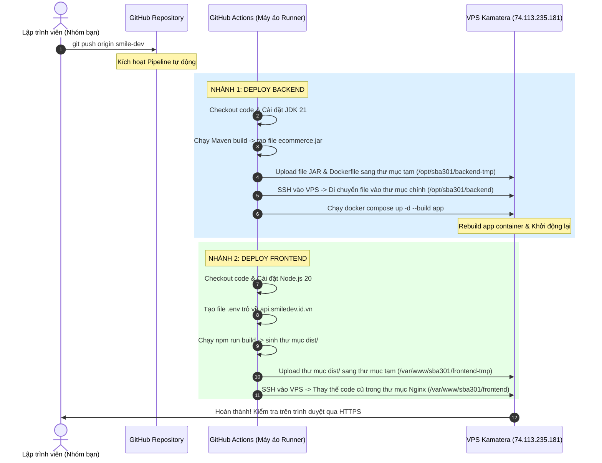

# Kiến Trúc và Quy Trình Tự Động Hóa CI/CD

Tài liệu này giải thích chi tiết toàn bộ kiến trúc hạ tầng và quy trình tích hợp/triển khai tự động (CI/CD Pipeline) của dự án **SBA301 - Small Clothing E-commerce** trên máy chủ VPS Kamatera.

---

## 1. Sơ Đồ Quy Trình Hoạt Động (CI/CD Flow)



---

## 2. Mô Tả Chi Tiết Từng Bước Trong Pipeline

Quy trình tự động hóa được chia làm **7 bước tuần tự** và chạy hoàn toàn tự động khi có code mới:

### Bước 1: Phát triển ở máy local
Bạn hoặc các thành viên trong nhóm hoàn thành một tính năng hoặc sửa lỗi ở máy local, kiểm tra chạy thử ở localhost thấy hoạt động đúng.
### Bước 2: Đẩy mã nguồn lên GitHub (Git Push)
Khi bạn gõ lệnh:
```bash
git add .
git commit -m "feat: mô tả tính năng mới"
git push origin smile-dev
```
* **Chi tiết thao tác**: 
  - Lệnh `git add .` sẽ gom tất cả các file bạn vừa sửa đổi ở máy tính cá nhân vào một "giỏ hàng".
  - Lệnh `git commit` sẽ dán một nhãn ghi chú cho giỏ hàng đó để dễ theo dõi sau này.
  - Lệnh `git push` thực chất là lệnh gửi toàn bộ các file mới này qua mạng internet lên các máy chủ lưu trữ của GitHub (ở đây là tài khoản và repository `longmoon2k4/SBA301-CICD`).

---

### Bước 3: GitHub Actions phát hiện sự thay đổi và kích hoạt máy ảo (Runner)
* **Chi tiết thao tác**: 
  - Ngay khi bạn push code lên nhánh `smile-dev`, máy chủ của GitHub nhận được tín hiệu. Nó lập tức quét trong thư mục đặc biệt `.github/workflows/` xem có file cấu hình nào tên là `deploy.yml` không.
  - Sau khi tìm thấy, nó đọc dòng lệnh `on: push: branches: - smile-dev` (nghĩa là: "khi có ai đó push lên nhánh smile-dev thì chạy").
  - GitHub sẽ tự động tạo ra một **máy ảo Ubuntu trống** (được gọi là **Runner** - máy chạy). Máy ảo này do GitHub cấp miễn phí cho bạn, nằm trên trung tâm dữ liệu đám mây của Microsoft. 
  - Khi máy ảo khởi động xong, nó sẽ chạy lệnh `git clone` để tải toàn bộ mã nguồn của bạn từ GitHub về ổ đĩa của máy ảo đó để chuẩn bị xử lý.

---

### Bước 4: Biên dịch và đóng gói trên máy ảo (Build Phase - CI)
Máy ảo này chạy song song 2 luồng công việc hoàn toàn độc lập:
* **Đối với Backend (Java)**:
  - Máy ảo sẽ tự động tải và cài đặt bộ chạy **JDK 21 (Temurin)**.
  - Nó chạy lệnh `./mvnw clean package -DskipTests`. 
  - *Giải thích*: Java là ngôn ngữ cần biên dịch. Lệnh này sẽ quét toàn bộ các file `.java` (vốn là ngôn ngữ con người đọc) và biên dịch chúng thành mã máy bytecode (dạng nhị phân mà máy tính đọc được), sau đó nén toàn bộ chúng lại thành một file duy nhất là `ecommerce.jar` nằm trong thư mục `target/`.
* **Đối với Frontend (React)**:
  - Máy ảo tự cài đặt môi trường **Node.js 20**.
  - Nó tạo ra một file cấu hình `.env` chứa dòng `VITE_API_BASE_URL=https://api.smiledev.id.vn/api/v1` (để code React biết đường mà gọi đến API thật).
  - Nó chạy lệnh `npm install` để tải toàn bộ thư viện giao diện (Bootstrap, Axios, v.v.) về.
  - Nó chạy lệnh `npm run build` để "nén và tối ưu hóa" code React (từ hàng trăm file nhỏ thành vài file HTML/JS/CSS siêu nhẹ) và lưu vào thư mục `dist/`.

---

### Bước 5: Kết nối SSH và vận chuyển file sang VPS (Transfer Phase - CD)
* **Chi tiết thao tác**:
  - Máy ảo của GitHub sử dụng giao thức **SSH** (Secure Shell - kết nối điều khiển từ xa mã hóa) để đăng nhập vào VPS của bạn tại địa chỉ IP `74.113.235.181` dưới quyền tài khoản cao nhất là `root`.
  - Để đăng nhập mà không cần nhập mật khẩu bằng tay, máy ảo đọc khóa bí mật **`VPS_SSH_KEY`** mà bạn đã dán vào mục *Secrets* trên GitHub. Khóa này khớp với khóa công khai trên VPS nên VPS sẽ mở cửa cho máy ảo đi vào.
  - Sau đó, máy ảo sử dụng giao thức **SCP** (Secure Copy Protocol - giao thức sao chép file bảo mật qua mạng) để tải:
    - File `ecommerce.jar` và file `Dockerfile` của Backend lên thư mục tạm `/opt/sba301/backend-tmp` trên VPS.
    - Thư mục build `dist/` của Frontend lên thư mục tạm `/var/www/sba301/frontend-tmp` trên VPS.

---

### Bước 6: Khởi chạy và cập nhật ứng dụng trên VPS (Deploy Phase - CD)
Sau khi copy xong các file tạm lên VPS, máy ảo GitHub gửi các lệnh chạy trực tiếp trên VPS để kích hoạt code mới:

* **Đối với Backend (Docker)**:
  - Nó chạy lệnh di chuyển file JAR từ thư mục tạm vào vị trí chính thức: `/opt/sba301/backend/target/ecommerce.jar` (thay thế file JAR cũ).
  - Nó chạy lệnh di chuyển `Dockerfile` vào `/opt/sba301/backend/Dockerfile`.
  - Nó truy cập vào thư mục `/opt/sba301/backend/` và thực thi lệnh:
    ```bash
    docker compose up -d --build app
    ```
  - *Giải thích*: Docker Compose sẽ đọc file cấu hình và phát hiện thấy service `app` cần build lại. Nó sẽ gọi Docker build lại Image dựa trên `Dockerfile` và file `ecommerce.jar` mới. Sau đó, nó tắt container `sba301-app` cũ đi và bật container mới lên thay thế. Dữ liệu trong container Database `sba301-db` không bị ảnh hưởng vì nó chạy độc lập.

* **Đối với Frontend (Nginx)**:
  - Nó chạy lệnh xóa sạch toàn bộ các file giao diện cũ trong thư mục `/var/www/sba301/frontend/`.
  - Nó di chuyển toàn bộ code giao diện mới từ thư mục tạm `/var/www/sba301/frontend-tmp/` vào `/var/www/sba301/frontend/`.
  - Nó chạy lệnh `chown -R www-data:www-data /var/www/sba301/frontend/` để cấp quyền cho Web Server Nginx có quyền đọc và hiển thị các file giao diện này lên internet.

---

### Bước 7: Khách hàng truy cập trải nghiệm (User Access)
* **Chi tiết thao tác**:
  - Khi khách hàng gõ `https://shop.smiledev.id.vn`, trình duyệt gửi yêu cầu kết nối HTTPS bảo mật (đã được cấp chứng chỉ SSL) đến VPS.
  - Web Server Nginx tiếp nhận yêu cầu, đọc các file tĩnh (HTML/JS) trong thư mục `/var/www/sba301/frontend/` và gửi trả về trình duyệt của khách hàng. Giao diện web React sẽ hiển thị lên màn hình.
  - Khi khách hàng thực hiện Đăng nhập, trình duyệt của họ sẽ gửi yêu cầu API đến đường dẫn `https://api.smiledev.id.vn/api/v1/auth/login`.
  - Nginx tiếp nhận yêu cầu API này, nhận dạng nó thuộc về subdomain `api` nên chuyển tiếp (Reverse Proxy) yêu cầu đó vào cổng nội bộ `8080` (nơi container backend `sba301-app` đang lắng nghe).
  - Backend Spring Boot nhận yêu cầu, kiểm tra thông tin đăng nhập bằng cách truy vấn cơ sở dữ liệu nội bộ ở cổng `3306` của container MariaDB (`sba301-db`) và trả về kết quả đăng nhập thành công cho khách hàng!

---
---

## 3. Cấu Trúc Các File Cấu Hình Quan Trọng

### A. File cấu hình Docker Compose trên VPS
Nằm tại `/opt/sba301/backend/docker-compose.yml`. File này quản lý việc khởi chạy Database MariaDB và Spring Boot kết nối nội bộ với nhau:
* **Dịch vụ `db`**: Chạy database MariaDB ở cổng nội bộ 3306, lưu dữ liệu an toàn vào Docker Volume `db_data` trên đĩa cứng VPS để tránh mất dữ liệu khi restart.
* **Dịch vụ `app`**: Chạy backend Java, phụ thuộc vào `db`, nhận các thông số kết nối thông qua biến môi trường được truyền trực tiếp từ file cấu hình.

### B. File cấu hình Nginx trên VPS host
Nằm tại `/etc/nginx/sites-available/sba301`. Nginx đóng vai trò là chốt chặn cổng 80/443 (HTTP/HTTPS):
* Phục vụ file tĩnh cho tên miền `shop.smiledev.id.vn` trỏ vào `/var/www/sba301/frontend/`.
* Chuyển tiếp (Reverse Proxy) các request của tên miền `api.smiledev.id.vn` vào `http://127.0.0.1:8080/` (nơi backend docker đang lắng nghe).
* Tự động cấu hình mã hóa SSL Let's Encrypt để chuyển hướng toàn bộ kết nối HTTP không bảo mật sang HTTPS an toàn.

---

## 4. Hướng Dẫn Vận Hành & Bảo Trì

### A. Cách xem quá trình build/deploy trực tiếp
1. Truy cập vào Repository của bạn trên GitHub.
2. Click vào tab **Actions** trên thanh công cụ đầu trang.
3. Chọn commit đang chạy (vòng tròn màu vàng xoay) -> click vào Job **Build & Deploy Backend/Frontend** để xem trực tiếp log terminal đang chạy của máy ảo GitHub.

### B. Cách cập nhật mật khẩu, API key hoặc Gmail gửi thư
Vì lý do bảo mật, các mật khẩu thật không được đẩy lên GitHub mà được quản lý thông qua Ansible ở máy cá nhân:
1. Mở file [ansible/group_vars/all.yml](file:///e:/cicid/ansible/group_vars/all.yml) ở máy local ra chỉnh sửa (ví dụ đổi `db_password` hoặc `smtp_password`).
2. Mở PowerShell tại thư mục local và chạy lệnh Ansible để cập nhật cấu hình tự động lên VPS:
   ```powershell
   docker run --rm -it -v ${PWD}:/work -v ${HOME}/.ssh:/tmp/ssh_mount -e ANSIBLE_HOST_KEY_CHECKING=False -w /work/ansible alpine/ansible sh -c "cp /tmp/ssh_mount/id_rsa /tmp/id_rsa && chmod 600 /tmp/id_rsa && ansible-playbook --private-key=/tmp/id_rsa -i inventory/hosts.ini playbook.yml"
   ```
