# 📊 Data-Flow Documentation — SBA301 E-commerce

> **Phạm vi:** Cart · Checkout · Order History · Address  
> **Tech Stack:** Spring Boot 3 (Java) + React 18 (Vite) + MySQL  
> **Ngày tạo:** 23/07/2026  
> **Người phụ trách:** Member phụ trách Cart, Checkout, Order History, Address

---

## Mục lục

1. [Tổng quan kiến trúc & Tech Stack](#1-tổng-quan-kiến-trúc--tech-stack)
2. [Database ERD (các bảng liên quan)](#2-database-erd)
3. [API Endpoints tổng hợp](#3-api-endpoints-tổng-hợp)
4. [Module 1: CART (Giỏ hàng)](#4-module-1-cart-giỏ-hàng)
5. [Module 2: CHECKOUT (Thanh toán)](#5-module-2-checkout-thanh-toán)
6. [Module 3: ORDER HISTORY (Lịch sử đơn hàng)](#6-module-3-order-history-lịch-sử-đơn-hàng)
7. [Module 4: ADDRESS (Sổ địa chỉ)](#7-module-4-address-sổ-địa-chỉ)
8. [Background Processes (Scheduled Jobs)](#8-background-processes)
9. [Cross-Module Data Flow](#9-cross-module-data-flow)

---

## 1. Tổng quan kiến trúc & Tech Stack

### 1.1. Kiến trúc hệ thống tổng quan

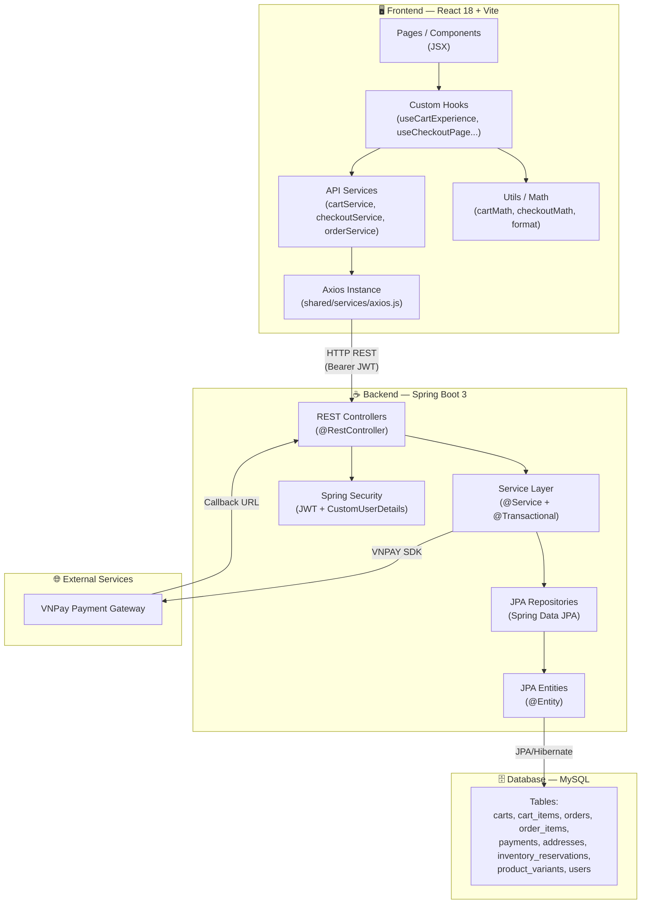
```mermaid
flowchart TB
    subgraph CLIENT["🖥️ Frontend — React 18 + Vite"]
        direction TB
        PAGES["Pages / Components<br/>(JSX)"]
        HOOKS["Custom Hooks<br/>(useCartExperience, useCheckoutPage...)"]
        SERVICES["API Services<br/>(cartService, checkoutService, orderService)"]
        UTILS["Utils / Math<br/>(cartMath, checkoutMath, format)"]
        AXIOS["Axios Instance<br/>(shared/services/axios.js)"]
        
        PAGES --> HOOKS
        HOOKS --> SERVICES
        HOOKS --> UTILS
        SERVICES --> AXIOS
    end

    subgraph SERVER["☕ Backend — Spring Boot 3"]
        direction TB
        CONTROLLERS["REST Controllers<br/>(@RestController)"]
        SERVICESL["Service Layer<br/>(@Service + @Transactional)"]
        REPOS["JPA Repositories<br/>(Spring Data JPA)"]
        ENTITIES["JPA Entities<br/>(@Entity)"]
        SECURITY["Spring Security<br/>(JWT + CustomUserDetails)"]
        
        CONTROLLERS --> SERVICESL
        CONTROLLERS --> SECURITY
        SERVICESL --> REPOS
        REPOS --> ENTITIES
    end

    subgraph DB["🗄️ Database — MySQL"]
        TABLES["Tables:<br/>carts, cart_items, orders, order_items,<br/>payments, addresses, inventory_reservations,<br/>product_variants, users"]
    end

    subgraph EXTERNAL["🌐 External Services"]
        VNPAY["VNPay Payment Gateway"]
    end

    AXIOS -- "HTTP REST<br/>(Bearer JWT)" --> CONTROLLERS
    ENTITIES -- "JPA/Hibernate" --> TABLES
    SERVICESL -- "VNPAY SDK" --> VNPAY
    VNPAY -- "Callback URL" --> CONTROLLERS
```

### 1.2. Tech Stack chi tiết

| Layer | Technology | Chi tiết |
|-------|-----------|---------|
| **Frontend** | React 18 + Vite | SPA, React Router v6, React Bootstrap |
| **State Management** | React Query (@tanstack/react-query) + useState | Server state caching + polling |
| **HTTP Client** | Axios | Interceptors cho JWT & 401 handling |
| **Backend** | Spring Boot 3 | REST API, Spring Security, Spring Data JPA |
| **Auth** | JWT (Bearer Token) | `localStorage.accessToken` → `Authorization: Bearer <token>` |
| **Database** | MySQL | JPA/Hibernate ORM |
| **Payment** | VNPay | Redirect-based payment, HMAC signature verification |

### 1.3. Frontend Feature Architecture (theo module)

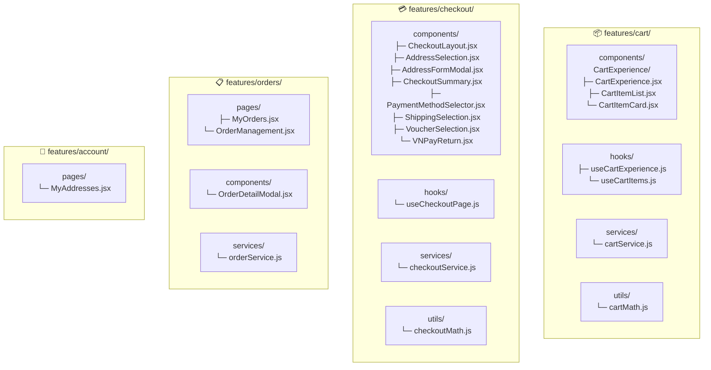
```mermaid
graph TD
    subgraph CART_MODULE["📦 features/cart/"]
        C_COMP["components/<br/>CartExperience/<br/>├─ CartExperience.jsx<br/>├─ CartItemList.jsx<br/>└─ CartItemCard.jsx"]
        C_HOOKS["hooks/<br/>├─ useCartExperience.js<br/>└─ useCartItems.js"]
        C_SVC["services/<br/>└─ cartService.js"]
        C_UTILS["utils/<br/>└─ cartMath.js"]
    end

    subgraph CHECKOUT_MODULE["💳 features/checkout/"]
        CK_COMP["components/<br/>├─ CheckoutLayout.jsx<br/>├─ AddressSelection.jsx<br/>├─ AddressFormModal.jsx<br/>├─ CheckoutSummary.jsx<br/>├─ PaymentMethodSelector.jsx<br/>├─ ShippingSelection.jsx<br/>├─ VoucherSelection.jsx<br/>└─ VNPayReturn.jsx"]
        CK_HOOKS["hooks/<br/>└─ useCheckoutPage.js"]
        CK_SVC["services/<br/>└─ checkoutService.js"]
        CK_UTILS["utils/<br/>└─ checkoutMath.js"]
    end

    subgraph ORDER_MODULE["📋 features/orders/"]
        O_PAGES["pages/<br/>├─ MyOrders.jsx<br/>└─ OrderManagement.jsx"]
        O_COMP["components/<br/>└─ OrderDetailModal.jsx"]
        O_SVC["services/<br/>└─ orderService.js"]
    end

    subgraph ADDR_MODULE["📍 features/account/"]
        A_PAGES["pages/<br/>└─ MyAddresses.jsx"]
    end
```

---

## 2. Database ERD

### 2.1. ERD các bảng liên quan trực tiếp

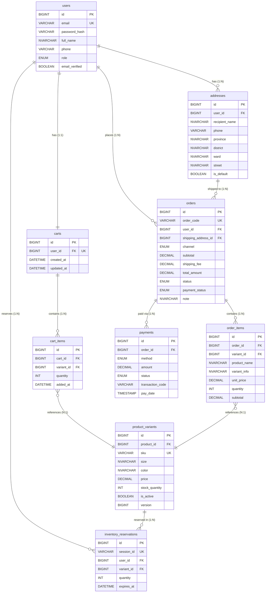
```mermaid
erDiagram
    users ||--|| carts : "has (1:1)"
    users ||--o{ addresses : "has (1:N)"
    users ||--o{ orders : "places (1:N)"
    users ||--o{ inventory_reservations : "reserves (1:N)"

    carts ||--o{ cart_items : "contains (1:N)"
    cart_items }o--|| product_variants : "references (N:1)"

    orders ||--o{ order_items : "contains (1:N)"
    orders ||--o{ payments : "paid via (1:N)"
    order_items }o--|| product_variants : "references (N:1)"
    addresses ||--o{ orders : "shipped to (1:N)"

    product_variants ||--o{ inventory_reservations : "reserved in (1:N)"

    users {
        BIGINT id PK
        VARCHAR email UK
        VARCHAR password_hash
        NVARCHAR full_name
        VARCHAR phone
        ENUM role
        BOOLEAN email_verified
    }

    carts {
        BIGINT id PK
        BIGINT user_id FK "UK"
        DATETIME created_at
        DATETIME updated_at
    }

    cart_items {
        BIGINT id PK
        BIGINT cart_id FK
        BIGINT variant_id FK
        INT quantity
        DATETIME added_at
    }

    addresses {
        BIGINT id PK
        BIGINT user_id FK
        NVARCHAR recipient_name
        VARCHAR phone
        NVARCHAR province
        NVARCHAR district
        NVARCHAR ward
        NVARCHAR street
        BOOLEAN is_default
    }

    orders {
        BIGINT id PK
        VARCHAR order_code UK
        BIGINT user_id FK
        BIGINT shipping_address_id FK
        ENUM channel
        DECIMAL subtotal
        DECIMAL shipping_fee
        DECIMAL total_amount
        ENUM status
        ENUM payment_status
        NVARCHAR note
    }

    order_items {
        BIGINT id PK
        BIGINT order_id FK
        BIGINT variant_id FK
        NVARCHAR product_name
        NVARCHAR variant_info
        DECIMAL unit_price
        INT quantity
        DECIMAL subtotal
    }

    payments {
        BIGINT id PK
        BIGINT order_id FK
        ENUM method
        DECIMAL amount
        ENUM status
        VARCHAR transaction_code
        TIMESTAMP pay_date
    }

    inventory_reservations {
        BIGINT id PK
        VARCHAR session_id UK
        BIGINT user_id FK
        BIGINT variant_id FK
        INT quantity
        DATETIME expires_at
    }

    product_variants {
        BIGINT id PK
        BIGINT product_id FK
        VARCHAR sku UK
        NVARCHAR size
        NVARCHAR color
        DECIMAL price
        INT stock_quantity
        BOOLEAN is_active
        BIGINT version
    }
```

### 2.2. Enum Definitions

| Enum | Giá trị |
|------|---------|
| **OrderStatus** | `PENDING` → `CONFIRMED` → `PROCESSING` → `SHIPPING` → `DELIVERED` → `COMPLETED` · `CANCELLED` |
| **OrderPaymentStatus** | `UNPAID` · `PAID` · `REFUNDED` |
| **OrderChannel** | `ONLINE` · `IN_STORE` |
| **PaymentMethod** | `COD` · `VNPAY` · `MOMO` · `BANK_TRANSFER` · `CASH` |
| **PaymentTxnStatus** | `PENDING` · `SUCCESS` · `FAILED` · `REFUNDED` |

---

## 3. API Endpoints tổng hợp

### 3.1. Cart APIs

| Method | Endpoint | Mô tả | Auth |
|--------|----------|-------|------|
| `GET` | `/api/v1/carts/me` | Lấy giỏ hàng của user hiện tại | ✅ JWT |
| `POST` | `/api/v1/carts/items` | Thêm sản phẩm vào giỏ | ✅ JWT |
| `PUT` | `/api/v1/carts/items/{id}` | Cập nhật số lượng cart item | ✅ JWT |
| `DELETE` | `/api/v1/carts/items/{id}` | Xóa sản phẩm khỏi giỏ | ✅ JWT |

### 3.2. Checkout Session APIs

| Method | Endpoint | Mô tả | Auth |
|--------|----------|-------|------|
| `POST` | `/api/v1/checkout/session/init` | Tạo phiên checkout (reserve inventory) | ✅ JWT |
| `GET` | `/api/v1/checkout/session/{sessionId}` | Lấy thông tin phiên checkout | ✅ JWT |
| `DELETE` | `/api/v1/checkout/session/{sessionId}` | Hủy phiên checkout (release inventory) | ✅ JWT |

### 3.3. Order APIs

| Method | Endpoint | Mô tả | Auth |
|--------|----------|-------|------|
| `POST` | `/api/v1/orders` | Tạo đơn hàng mới | ✅ JWT |
| `GET` | `/api/v1/orders/me` | Danh sách đơn hàng của tôi | ✅ JWT |
| `GET` | `/api/v1/orders/{orderCode}` | Chi tiết đơn hàng theo mã | ✅ JWT |
| `GET` | `/api/v1/orders/vnpay-callback` | VNPay callback xử lý kết quả thanh toán | ✅ JWT |

### 3.4. Admin Order APIs

| Method | Endpoint | Mô tả | Auth |
|--------|----------|-------|------|
| `GET` | `/api/v1/admin/orders` | Tìm kiếm/lọc đơn hàng (admin) | ✅ JWT (ADMIN/STAFF) |
| `PUT` | `/api/v1/admin/orders/{id}/status` | Cập nhật trạng thái đơn hàng | ✅ JWT (ADMIN/STAFF) |

### 3.5. Address APIs

| Method | Endpoint | Mô tả | Auth |
|--------|----------|-------|------|
| `GET` | `/api/v1/addresses` | Danh sách địa chỉ của user | ✅ JWT |
| `POST` | `/api/v1/addresses` | Thêm địa chỉ mới | ✅ JWT |
| `DELETE` | `/api/v1/addresses/{id}` | Xóa địa chỉ | ✅ JWT |

---

## 4. Module 1: CART (Giỏ hàng)

### 4.1. Component Architecture

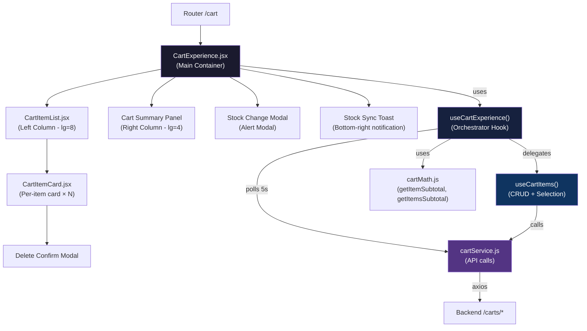
```mermaid
graph TD
    ROUTER["Router /cart"] --> CE["CartExperience.jsx<br/>(Main Container)"]
    CE --> CIL["CartItemList.jsx<br/>(Left Column - lg=8)"]
    CE --> SUMMARY["Cart Summary Panel<br/>(Right Column - lg=4)"]
    CE --> MODAL["Stock Change Modal<br/>(Alert Modal)"]
    CE --> TOAST["Stock Sync Toast<br/>(Bottom-right notification)"]
    
    CIL --> CIC["CartItemCard.jsx<br/>(Per-item card × N)"]
    CIC --> DELETE_MODAL["Delete Confirm Modal"]

    CE -- "uses" --> UCE["useCartExperience()<br/>(Orchestrator Hook)"]
    UCE -- "delegates" --> UCI["useCartItems()<br/>(CRUD + Selection)"]
    UCE -- "polls 5s" --> CS["cartService.js<br/>(API calls)"]
    UCI -- "calls" --> CS
    CS -- "axios" --> API["Backend /carts/*"]

    UCE -- "uses" --> CM["cartMath.js<br/>(getItemSubtotal, getItemsSubtotal)"]

    style CE fill:#1a1a2e,color:#fff
    style UCE fill:#16213e,color:#fff
    style UCI fill:#0f3460,color:#fff
    style CS fill:#533483,color:#fff
```

### 4.2. Flow 1 — Xem giỏ hàng (Load Cart)

**Trigger:** User mở trang `/cart` hoặc component `CartExperience` được mount.

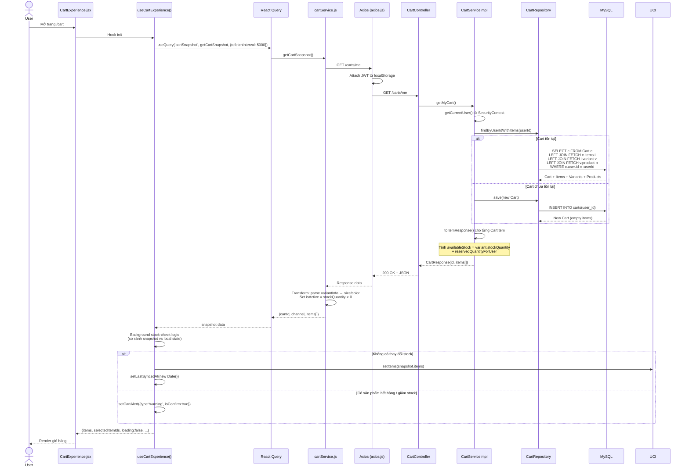
```mermaid
sequenceDiagram
    actor User
    participant CE as CartExperience.jsx
    participant UCE as useCartExperience()
    participant RQ as React Query
    participant CS as cartService.js
    participant AX as Axios (axios.js)
    participant CC as CartController
    participant CSI as CartServiceImpl
    participant CR as CartRepository
    participant DB as MySQL

    User->>CE: Mở trang /cart
    CE->>UCE: Hook init
    UCE->>RQ: useQuery('cartSnapshot', getCartSnapshot, {refetchInterval: 5000})
    RQ->>CS: getCartSnapshot()
    CS->>AX: GET /carts/me
    AX->>AX: Attach JWT từ localStorage
    AX->>CC: GET /carts/me

    CC->>CSI: getMyCart()
    CSI->>CSI: getCurrentUser() từ SecurityContext
    CSI->>CR: findByUserIdWithItems(userId)
    
    alt Cart tồn tại
        CR->>DB: SELECT c FROM Cart c<br/>LEFT JOIN FETCH c.items i<br/>LEFT JOIN FETCH i.variant v<br/>LEFT JOIN FETCH v.product p<br/>WHERE c.user.id = :userId
        DB-->>CR: Cart + Items + Variants + Products
    else Cart chưa tồn tại
        CSI->>CR: save(new Cart)
        CR->>DB: INSERT INTO carts(user_id)
        DB-->>CR: New Cart (empty items)
    end

    CSI->>CSI: toItemResponse() cho từng CartItem
    Note over CSI: Tính availableStock = variant.stockQuantity<br/>+ reservedQuantityForUser
    CSI-->>CC: CartResponse{id, items[]}
    CC-->>AX: 200 OK + JSON
    AX-->>CS: Response data

    CS->>CS: Transform: parse variantInfo → size/color<br/>Set isActive = stockQuantity > 0
    CS-->>RQ: {cartId, channel, items[]}
    RQ-->>UCE: snapshot data

    UCE->>UCE: Background stock-check logic<br/>(so sánh snapshot vs local state)
    
    alt Không có thay đổi stock
        UCE->>UCI: setItems(snapshot.items)
        UCE->>UCE: setLastSyncedAt(new Date())
    else Có sản phẩm hết hàng / giảm stock
        UCE->>UCE: setCartAlert({type:'warning', isConfirm:true})
    end

    UCE-->>CE: {items, selectedItemIds, loading:false, ...}
    CE-->>User: Render giỏ hàng
```

**Request/Response:**

```json
// GET /api/v1/carts/me
// Response 200:
{
  "id": 12,
  "items": [
    {
      "id": 1001,
      "variantId": 501,
      "productName": "Áo thun cotton basic",
      "variantInfo": "M / Trắng",
      "sku": "AO-COT-M-WHT",
      "unitPrice": 199000,
      "quantity": 2,
      "discount": 0,
      "stockQuantity": 12
    }
  ]
}
```

**Frontend Transform (cartService.js):**
```javascript
// Backend trả variantInfo = "M / Trắng"
// Frontend parse thành:
{
  ...item,
  size: "M",           // parts[0]
  color: "Trắng",      // parts[1]
  isActive: item.stockQuantity > 0  // derived field
}
```

**State Management:**

| State | Hook | Mô tả |
|-------|------|-------|
| `items` | useCartItems | Danh sách cart items từ backend |
| `selectedItemIds` | useCartItems | Mảng ID các item user đã tick chọn |
| `loading` | React Query | `isLoading` từ useQuery |
| `cartAlert` | useCartExperience | Object hiển thị modal cảnh báo stock |
| `stockSyncNotice` | useCartExperience | Thông báo text về sync stock |
| `lastSyncedAt` | useCartExperience | Thời điểm sync thành công gần nhất |

---

### 4.3. Flow 2 — Thêm sản phẩm vào giỏ hàng (Add to Cart)

**Trigger:** User nhấn "Thêm vào giỏ" từ trang chi tiết sản phẩm (gọi `addToCart()` từ useCartItems).

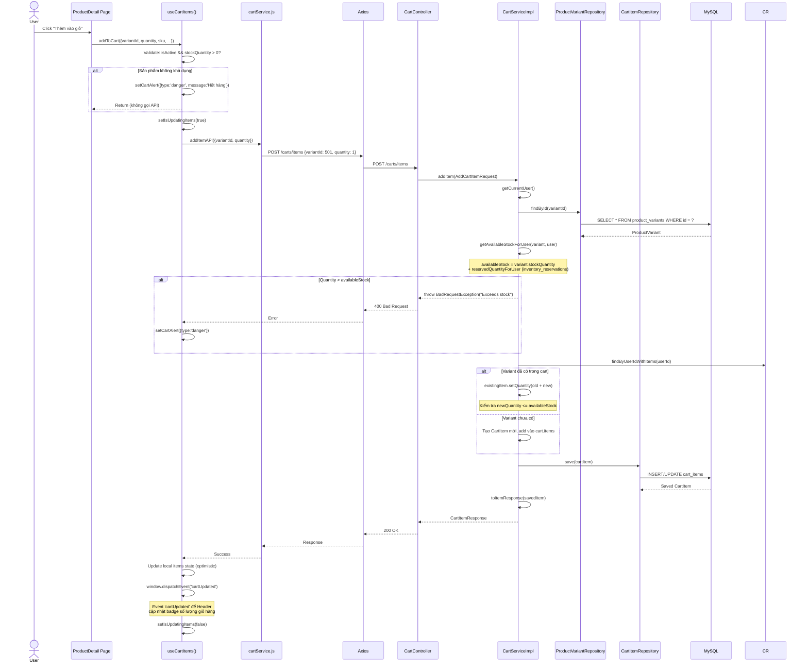
```mermaid
sequenceDiagram
    actor User
    participant PD as ProductDetail Page
    participant UCI as useCartItems()
    participant CS as cartService.js
    participant AX as Axios
    participant CC as CartController
    participant CSI as CartServiceImpl
    participant PVR as ProductVariantRepository
    participant CIR as CartItemRepository
    participant DB as MySQL

    User->>PD: Click "Thêm vào giỏ"
    PD->>UCI: addToCart({variantId, quantity, sku, ...})

    UCI->>UCI: Validate: isActive && stockQuantity > 0?
    alt Sản phẩm không khả dụng
        UCI->>UCI: setCartAlert({type:'danger', message:'Hết hàng'})
        UCI-->>PD: Return (không gọi API)
    end

    UCI->>UCI: setIsUpdatingItems(true)
    UCI->>CS: addItemAPI({variantId, quantity})
    CS->>AX: POST /carts/items {variantId: 501, quantity: 1}
    AX->>CC: POST /carts/items

    CC->>CSI: addItem(AddCartItemRequest)
    CSI->>CSI: getCurrentUser()
    CSI->>PVR: findById(variantId)
    PVR->>DB: SELECT * FROM product_variants WHERE id = ?
    DB-->>PVR: ProductVariant

    CSI->>CSI: getAvailableStockForUser(variant, user)
    Note over CSI: availableStock = variant.stockQuantity<br/>+ reservedQuantityForUser (inventory_reservations)
    
    alt Quantity > availableStock
        CSI-->>CC: throw BadRequestException("Exceeds stock")
        CC-->>AX: 400 Bad Request
        AX-->>UCI: Error
        UCI->>UCI: setCartAlert({type:'danger'})
    end

    CSI->>CR: findByUserIdWithItems(userId)
    
    alt Variant đã có trong cart
        CSI->>CSI: existingItem.setQuantity(old + new)
        Note over CSI: Kiểm tra newQuantity <= availableStock
    else Variant chưa có
        CSI->>CSI: Tạo CartItem mới, add vào cart.items
    end

    CSI->>CIR: save(cartItem)
    CIR->>DB: INSERT/UPDATE cart_items
    DB-->>CIR: Saved CartItem

    CSI->>CSI: toItemResponse(savedItem)
    CSI-->>CC: CartItemResponse
    CC-->>AX: 200 OK
    AX-->>CS: Response
    CS-->>UCI: Success

    UCI->>UCI: Update local items state (optimistic)
    UCI->>UCI: window.dispatchEvent('cartUpdated')
    Note over UCI: Event 'cartUpdated' để Header<br/>cập nhật badge số lượng giỏ hàng
    UCI->>UCI: setIsUpdatingItems(false)
```

**Request/Response:**

```json
// POST /api/v1/carts/items
// Request Body:
{
  "variantId": 501,
  "quantity": 1
}

// Response 200:
{
  "id": 1005,
  "variantId": 501,
  "productName": "Áo thun cotton basic",
  "variantInfo": "M / Trắng",
  "sku": "AO-COT-M-WHT",
  "unitPrice": 199000,
  "quantity": 3,
  "discount": 0,
  "stockQuantity": 12
}
```

---

### 4.4. Flow 3 — Cập nhật số lượng (Update Quantity)

**Trigger:** User nhấn nút +/− hoặc nhập trực tiếp số lượng trên `CartItemCard`.

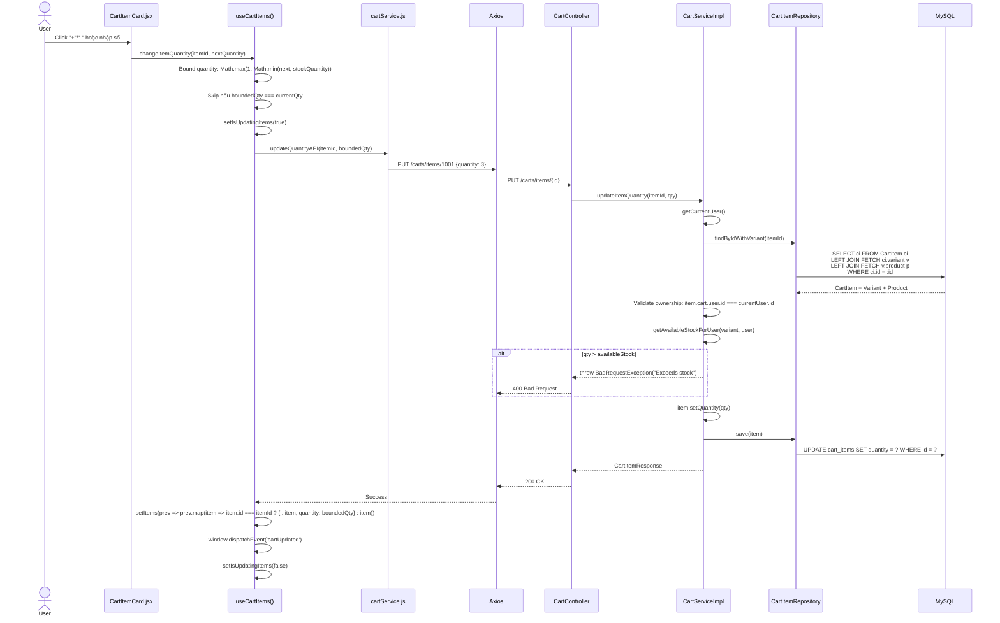
```mermaid
sequenceDiagram
    actor User
    participant CIC as CartItemCard.jsx
    participant UCI as useCartItems()
    participant CS as cartService.js
    participant AX as Axios
    participant CC as CartController
    participant CSI as CartServiceImpl
    participant CIR as CartItemRepository
    participant DB as MySQL

    User->>CIC: Click "+"/"-" hoặc nhập số
    CIC->>UCI: changeItemQuantity(itemId, nextQuantity)
    
    UCI->>UCI: Bound quantity: Math.max(1, Math.min(next, stockQuantity))
    UCI->>UCI: Skip nếu boundedQty === currentQty
    
    UCI->>UCI: setIsUpdatingItems(true)
    UCI->>CS: updateQuantityAPI(itemId, boundedQty)
    CS->>AX: PUT /carts/items/1001 {quantity: 3}
    AX->>CC: PUT /carts/items/{id}
    
    CC->>CSI: updateItemQuantity(itemId, qty)
    CSI->>CSI: getCurrentUser()
    CSI->>CIR: findByIdWithVariant(itemId)
    CIR->>DB: SELECT ci FROM CartItem ci<br/>LEFT JOIN FETCH ci.variant v<br/>LEFT JOIN FETCH v.product p<br/>WHERE ci.id = :id
    DB-->>CIR: CartItem + Variant + Product

    CSI->>CSI: Validate ownership: item.cart.user.id === currentUser.id
    CSI->>CSI: getAvailableStockForUser(variant, user)
    
    alt qty > availableStock
        CSI-->>CC: throw BadRequestException("Exceeds stock")
        CC-->>AX: 400 Bad Request
    end

    CSI->>CSI: item.setQuantity(qty)
    CSI->>CIR: save(item)
    CIR->>DB: UPDATE cart_items SET quantity = ? WHERE id = ?
    
    CSI-->>CC: CartItemResponse
    CC-->>AX: 200 OK
    AX-->>UCI: Success

    UCI->>UCI: setItems(prev => prev.map(item => item.id === itemId ? {...item, quantity: boundedQty} : item))
    UCI->>UCI: window.dispatchEvent('cartUpdated')
    UCI->>UCI: setIsUpdatingItems(false)
```

**Request/Response:**

```json
// PUT /api/v1/carts/items/1001
// Request Body:
{ "quantity": 3 }

// Response 200:
{
  "id": 1001,
  "variantId": 501,
  "productName": "Áo thun cotton basic",
  "variantInfo": "M / Trắng",
  "sku": "AO-COT-M-WHT",
  "unitPrice": 199000,
  "quantity": 3,
  "discount": 0,
  "stockQuantity": 12
}
```

---

### 4.5. Flow 4 — Xóa sản phẩm khỏi giỏ (Remove Item)

**Trigger:** User click "Xoá" trên `CartItemCard` → Confirm Modal → Xác nhận xóa.

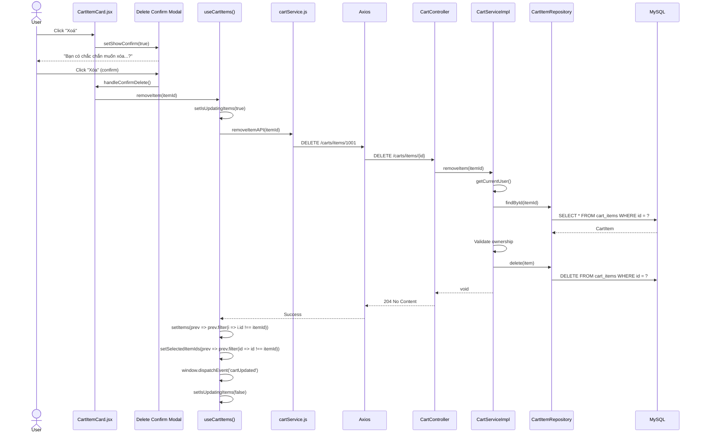
```mermaid
sequenceDiagram
    actor User
    participant CIC as CartItemCard.jsx
    participant MODAL as Delete Confirm Modal
    participant UCI as useCartItems()
    participant CS as cartService.js
    participant AX as Axios
    participant CC as CartController
    participant CSI as CartServiceImpl
    participant CIR as CartItemRepository
    participant DB as MySQL

    User->>CIC: Click "Xoá"
    CIC->>MODAL: setShowConfirm(true)
    MODAL-->>User: "Bạn có chắc chắn muốn xóa...?"

    User->>MODAL: Click "Xóa" (confirm)
    MODAL->>CIC: handleConfirmDelete()
    CIC->>UCI: removeItem(itemId)

    UCI->>UCI: setIsUpdatingItems(true)
    UCI->>CS: removeItemAPI(itemId)
    CS->>AX: DELETE /carts/items/1001
    AX->>CC: DELETE /carts/items/{id}

    CC->>CSI: removeItem(itemId)
    CSI->>CSI: getCurrentUser()
    CSI->>CIR: findById(itemId)
    CIR->>DB: SELECT * FROM cart_items WHERE id = ?
    DB-->>CIR: CartItem
    
    CSI->>CSI: Validate ownership
    CSI->>CIR: delete(item)
    CIR->>DB: DELETE FROM cart_items WHERE id = ?
    
    CSI-->>CC: void
    CC-->>AX: 204 No Content
    AX-->>UCI: Success

    UCI->>UCI: setItems(prev => prev.filter(i => i.id !== itemId))
    UCI->>UCI: setSelectedItemIds(prev => prev.filter(id => id !== itemId))
    UCI->>UCI: window.dispatchEvent('cartUpdated')
    UCI->>UCI: setIsUpdatingItems(false)
```

---

### 4.6. Flow 5 — Background Stock Sync (Polling mỗi 5 giây)

**Trigger:** Tự động — React Query refetch mỗi 5 giây (`refetchInterval: 5000`).

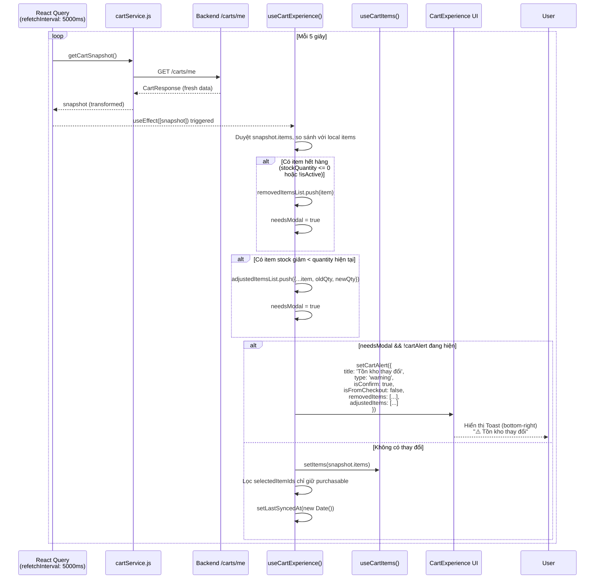
```mermaid
sequenceDiagram
    participant RQ as React Query<br/>(refetchInterval: 5000ms)
    participant CS as cartService.js
    participant API as Backend /carts/me
    participant UCE as useCartExperience()
    participant UCI as useCartItems()
    participant UI as CartExperience UI

    loop Mỗi 5 giây
        RQ->>CS: getCartSnapshot()
        CS->>API: GET /carts/me
        API-->>CS: CartResponse (fresh data)
        CS-->>RQ: snapshot (transformed)
        RQ-->>UCE: useEffect([snapshot]) triggered

        UCE->>UCE: Duyệt snapshot.items, so sánh với local items

        alt Có item hết hàng (stockQuantity <= 0 hoặc !isActive)
            UCE->>UCE: removedItemsList.push(item)
            UCE->>UCE: needsModal = true
        end

        alt Có item stock giảm < quantity hiện tại
            UCE->>UCE: adjustedItemsList.push({...item, oldQty, newQty})
            UCE->>UCE: needsModal = true
        end

        alt needsModal && !cartAlert đang hiện
            UCE->>UI: setCartAlert({<br/>  title: 'Tồn kho thay đổi',<br/>  type: 'warning',<br/>  isConfirm: true,<br/>  isFromCheckout: false,<br/>  removedItems: [...],<br/>  adjustedItems: [...]<br/>})
            UI-->>User: Hiển thị Toast (bottom-right)<br/>"⚠️ Tồn kho thay đổi"
        else Không có thay đổi
            UCE->>UCI: setItems(snapshot.items)
            UCE->>UCE: Lọc selectedItemIds chỉ giữ purchasable
            UCE->>UCE: setLastSyncedAt(new Date())
        end
    end
```

**Xử lý khi user click "Cập nhật lại giỏ hàng" trên Toast:**

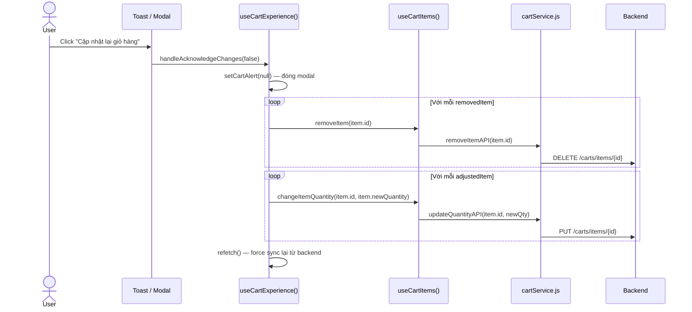
```mermaid
sequenceDiagram
    actor User
    participant UI as Toast / Modal
    participant UCE as useCartExperience()
    participant UCI as useCartItems()
    participant CS as cartService.js
    participant API as Backend

    User->>UI: Click "Cập nhật lại giỏ hàng"
    UI->>UCE: handleAcknowledgeChanges(false)
    
    UCE->>UCE: setCartAlert(null) — đóng modal

    loop Với mỗi removedItem
        UCE->>UCI: removeItem(item.id)
        UCI->>CS: removeItemAPI(item.id)
        CS->>API: DELETE /carts/items/{id}
    end

    loop Với mỗi adjustedItem
        UCE->>UCI: changeItemQuantity(item.id, item.newQuantity)
        UCI->>CS: updateQuantityAPI(item.id, newQty)
        CS->>API: PUT /carts/items/{id}
    end

    UCE->>UCE: refetch() — force sync lại từ backend
```

---

### 4.7. Flow 6 — Xử lý chọn/bỏ chọn sản phẩm (Selection Logic)

**Trigger:** User tick/bỏ tick checkbox trên từng item hoặc "Chọn tất cả".

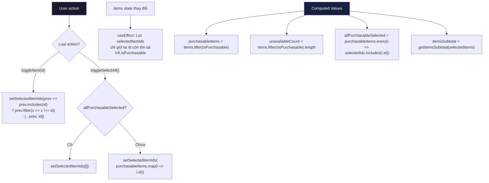
```mermaid
flowchart TD
    A["User action"] --> B{Loại action?}
    
    B -->|"toggleItem(id)"| C["setSelectedItemIds(prev =><br/>prev.includes(id)<br/>? prev.filter(x => x !== id)<br/>: [...prev, id])"]
    
    B -->|"toggleSelectAll()"| D{allPurchasableSelected?}
    D -->|Có| E["setSelectedItemIds([])"]
    D -->|Chưa| F["setSelectedItemIds(<br/>purchasableItems.map(i => i.id))"]

    G["items state thay đổi"] --> H["useEffect: Lọc selectedItemIds<br/>chỉ giữ lại id còn tồn tại<br/>VÀ isPurchasable"]

    I["Computed Values"] --> J["purchasableItems = items.filter(isPurchasable)"]
    I --> K["unavailableCount = items.filter(!isPurchasable).length"]
    I --> L["allPurchasableSelected = purchasableItems.every(i => selectedIds.includes(i.id))"]
    I --> M["itemsSubtotal = getItemsSubtotal(selectedItems)"]

    style A fill:#1a1a2e,color:#fff
    style I fill:#16213e,color:#fff
```

**Logic `isPurchasable`:**
```javascript
export const isPurchasable = (item) => item.isActive && item.stockQuantity > 0;
```

**Logic `getItemsSubtotal`:**
```javascript
export function getItemSubtotal(item) {
  return item.unitPrice * item.quantity;
}
export function getItemsSubtotal(items) {
  return items.reduce((sum, item) => sum + getItemSubtotal(item), 0);
}
```

---

## 5. Module 2: CHECKOUT (Thanh toán)

### 5.1. Component Architecture

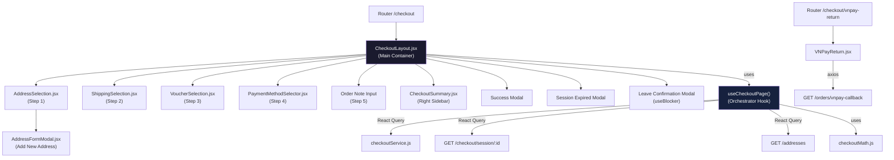
```mermaid
graph TD
    ROUTER["Router /checkout"] --> CL["CheckoutLayout.jsx<br/>(Main Container)"]
    
    CL --> ADDR["AddressSelection.jsx<br/>(Step 1)"]
    CL --> SHIP["ShippingSelection.jsx<br/>(Step 2)"]
    CL --> VOUCHER["VoucherSelection.jsx<br/>(Step 3)"]
    CL --> PAY["PaymentMethodSelector.jsx<br/>(Step 4)"]
    CL --> NOTE["Order Note Input<br/>(Step 5)"]
    CL --> CSUMM["CheckoutSummary.jsx<br/>(Right Sidebar)"]
    CL --> SUCCESS["Success Modal"]
    CL --> EXPIRE["Session Expired Modal"]
    CL --> BLOCKER["Leave Confirmation Modal<br/>(useBlocker)"]

    ADDR --> AFM["AddressFormModal.jsx<br/>(Add New Address)"]

    CL -- "uses" --> UCP["useCheckoutPage()<br/>(Orchestrator Hook)"]
    UCP -- "React Query" --> CSVC["checkoutService.js"]
    UCP -- "React Query" --> API_SESSION["GET /checkout/session/:id"]
    UCP -- "React Query" --> API_ADDR["GET /addresses"]
    UCP -- "uses" --> CMATH["checkoutMath.js"]

    ROUTER2["Router /checkout/vnpay-return"] --> VNR["VNPayReturn.jsx"]
    VNR -- "axios" --> API_VNPAY["GET /orders/vnpay-callback"]

    style CL fill:#1a1a2e,color:#fff
    style UCP fill:#16213e,color:#fff
```

### 5.2. Flow 1 — Khởi tạo phiên thanh toán (Cart → Checkout Transition)

**Trigger:** User nhấn "Tiến hành thanh toán" trên trang Cart.

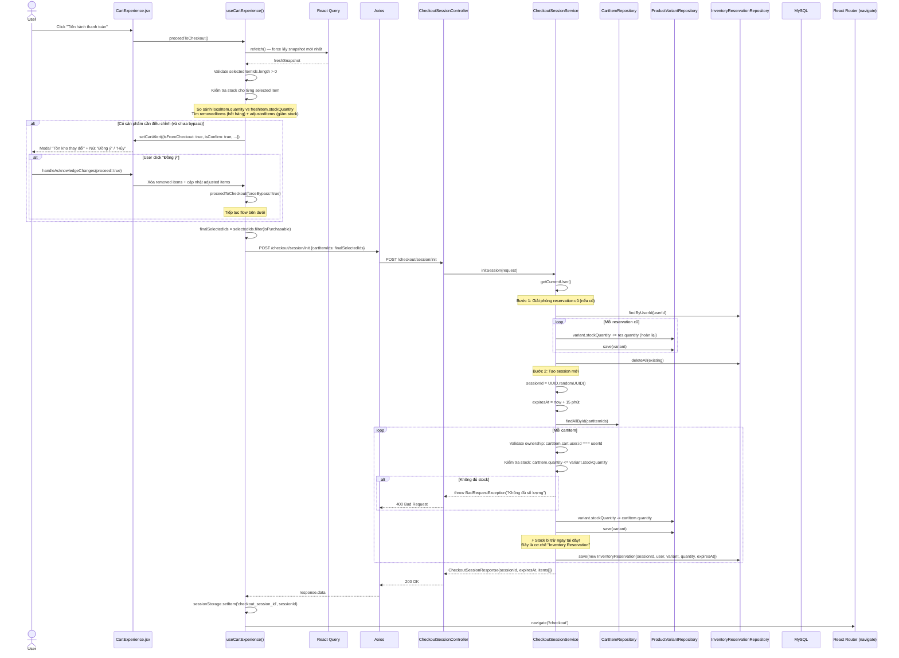
```mermaid
sequenceDiagram
    actor User
    participant CE as CartExperience.jsx
    participant UCE as useCartExperience()
    participant RQ as React Query
    participant AX as Axios
    participant CSC as CheckoutSessionController
    participant CSS as CheckoutSessionService
    participant CIR as CartItemRepository
    participant PVR as ProductVariantRepository
    participant IRR as InventoryReservationRepository
    participant DB as MySQL
    participant NAV as React Router (navigate)

    User->>CE: Click "Tiến hành thanh toán"
    CE->>UCE: proceedToCheckout()

    UCE->>RQ: refetch() — force lấy snapshot mới nhất
    RQ-->>UCE: freshSnapshot

    UCE->>UCE: Validate selectedItemIds.length > 0
    
    UCE->>UCE: Kiểm tra stock cho từng selected item
    Note over UCE: So sánh localItem.quantity vs freshItem.stockQuantity<br/>Tìm removedItems (hết hàng) + adjustedItems (giảm stock)

    alt Có sản phẩm cần điều chỉnh (và chưa bypass)
        UCE->>CE: setCartAlert({isFromCheckout: true, isConfirm: true, ...})
        CE-->>User: Modal "Tồn kho thay đổi" + Nút "Đồng ý" / "Hủy"
        
        alt User click "Đồng ý"
            User->>CE: handleAcknowledgeChanges(proceed=true)
            CE->>UCE: Xóa removed items + cập nhật adjusted items
            UCE->>UCE: proceedToCheckout(forceBypass=true)
            Note over UCE: Tiếp tục flow bên dưới
        end
    end

    UCE->>UCE: finalSelectedIds = selectedIds.filter(isPurchasable)

    UCE->>AX: POST /checkout/session/init {cartItemIds: finalSelectedIds}
    AX->>CSC: POST /checkout/session/init
    CSC->>CSS: initSession(request)
    
    CSS->>CSS: getCurrentUser()
    
    Note over CSS: Bước 1: Giải phóng reservation cũ (nếu có)
    CSS->>IRR: findByUserId(userId)
    loop Mỗi reservation cũ
        CSS->>PVR: variant.stockQuantity += res.quantity (hoàn lại)
        CSS->>PVR: save(variant)
    end
    CSS->>IRR: deleteAll(existing)

    Note over CSS: Bước 2: Tạo session mới
    CSS->>CSS: sessionId = UUID.randomUUID()
    CSS->>CSS: expiresAt = now + 15 phút
    
    CSS->>CIR: findAllById(cartItemIds)
    
    loop Mỗi cartItem
        CSS->>CSS: Validate ownership: cartItem.cart.user.id === userId
        CSS->>CSS: Kiểm tra stock: cartItem.quantity <= variant.stockQuantity
        
        alt Không đủ stock
            CSS-->>CSC: throw BadRequestException("Không đủ số lượng")
            CSC-->>AX: 400 Bad Request
        end
        
        CSS->>PVR: variant.stockQuantity -= cartItem.quantity
        CSS->>PVR: save(variant)
        Note over CSS: ⚡ Stock bị trừ ngay tại đây!<br/>Đây là cơ chế "Inventory Reservation"
        
        CSS->>IRR: save(new InventoryReservation{sessionId, user, variant, quantity, expiresAt})
    end

    CSS-->>CSC: CheckoutSessionResponse{sessionId, expiresAt, items[]}
    CSC-->>AX: 200 OK
    AX-->>UCE: response.data

    UCE->>UCE: sessionStorage.setItem('checkout_session_id', sessionId)
    UCE->>NAV: navigate('/checkout')
```

**Request/Response:**

```json
// POST /api/v1/checkout/session/init
// Request Body:
{
  "cartItemIds": [1001, 1002]
}

// Response 200:
{
  "sessionId": "a1b2c3d4-e5f6-7890-abcd-ef1234567890",
  "expiresAt": "2026-07-23T17:10:00+07:00",
  "items": [
    {
      "variantId": 501,
      "productId": 201,
      "productName": "Áo thun cotton basic",
      "productSlug": "ao-thun-cotton-basic",
      "productThumbnail": "https://...",
      "color": "Trắng",
      "size": "M",
      "unitPrice": 199000,
      "quantity": 2
    }
  ]
}
```

> **⚡ Quan trọng:** Khi `initSession` được gọi, `product_variants.stock_quantity` bị trừ ngay lập tức và dữ liệu được lưu vào bảng `inventory_reservations`. Nếu session hết hạn (15 phút) mà user chưa đặt hàng, scheduled job `releaseExpiredReservations()` sẽ hoàn lại stock.

---

### 5.3. Flow 2 — Load trang Checkout (Checkout Page Initialization)

**Trigger:** User được navigate đến `/checkout` sau khi init session thành công.

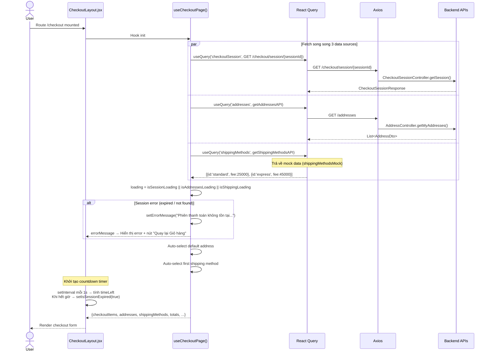
```mermaid
sequenceDiagram
    actor User
    participant CL as CheckoutLayout.jsx
    participant UCP as useCheckoutPage()
    participant RQ as React Query
    participant AX as Axios
    participant API as Backend APIs

    User->>CL: Route /checkout mounted
    CL->>UCP: Hook init

    par Fetch song song 3 data sources
        UCP->>RQ: useQuery('checkoutSession', GET /checkout/session/{sessionId})
        RQ->>AX: GET /checkout/session/{sessionId}
        AX->>API: CheckoutSessionController.getSession()
        API-->>RQ: CheckoutSessionResponse
    and
        UCP->>RQ: useQuery('addresses', getAddressesAPI)
        RQ->>AX: GET /addresses
        AX->>API: AddressController.getMyAddresses()
        API-->>RQ: List<AddressDto>
    and
        UCP->>RQ: useQuery('shippingMethods', getShippingMethodsAPI)
        Note over RQ: Trả về mock data (shippingMethodsMock)
        RQ-->>UCP: [{id:'standard', fee:25000}, {id:'express', fee:45000}]
    end

    UCP->>UCP: loading = isSessionLoading || isAddressesLoading || isShippingLoading
    
    alt Session error (expired / not found)
        UCP->>UCP: setErrorMessage("Phiên thanh toán không tồn tại...")
        UCP-->>CL: errorMessage → Hiển thị error + nút "Quay lại Giỏ hàng"
    end

    UCP->>UCP: Auto-select default address
    UCP->>UCP: Auto-select first shipping method

    Note over CL: Khởi tạo countdown timer
    CL->>CL: setInterval mỗi 1s → tính timeLeft<br/>Khi hết giờ → setIsSessionExpired(true)

    UCP-->>CL: {checkoutItems, addresses, shippingMethods, totals, ...}
    CL-->>User: Render checkout form
```

**State Management trong useCheckoutPage():**

| State | Default | Mô tả |
|-------|---------|-------|
| `selectedAddressId` | Auto-select default | ID địa chỉ giao hàng đã chọn |
| `selectedShippingId` | Auto-select first | ID phương thức vận chuyển |
| `voucherInput` | `''` | Mã voucher user nhập |
| `voucherApplied` | `null` | Object voucher đã áp dụng thành công |
| `orderNote` | `''` | Ghi chú đơn hàng |
| `selectedPaymentMethod` | `'COD'` | Phương thức thanh toán |
| `isPlacingOrder` | `false` | Đang gửi request đặt hàng |
| `sessionId` | From sessionStorage | ID phiên checkout |
| `sessionExpiresAt` | From API response | Thời gian hết hạn phiên |

**Computed Values:**

```javascript
const itemsSubtotal = getItemsSubtotal(checkoutItems);  // Σ(unitPrice × quantity)
const shippingFee = selectedShippingMethod?.fee || 0;
const discountAmount = getDiscountAmount({voucher, itemsSubtotal, shippingFee});
const totals = getCartTotals({itemsSubtotal, shippingFee, discountAmount});
// totals = { itemsSubtotal, shippingFee, discountAmount, finalTotal }
// finalTotal = Math.max(itemsSubtotal + shippingFee - discountAmount, 0)

const canCheckout = checkoutItems.length > 0 && !!selectedAddress && !!selectedShippingMethod;
```

---

### 5.4. Flow 3 — Thêm địa chỉ mới tại Checkout

**Trigger:** User nhấn "+ Thêm địa chỉ mới" trong AddressSelection → Điền form → Lưu.

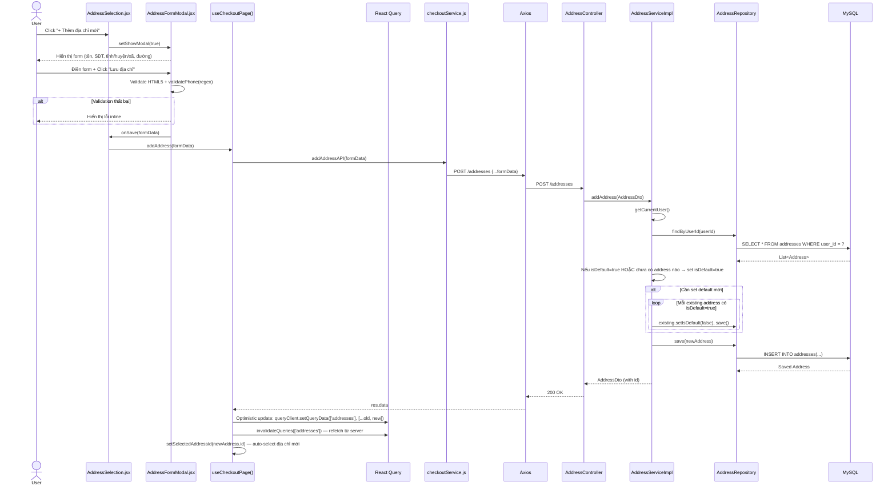
```mermaid
sequenceDiagram
    actor User
    participant AS as AddressSelection.jsx
    participant AFM as AddressFormModal.jsx
    participant UCP as useCheckoutPage()
    participant RQ as React Query
    participant CS as checkoutService.js
    participant AX as Axios
    participant AC as AddressController
    participant ASI as AddressServiceImpl
    participant AR as AddressRepository
    participant DB as MySQL

    User->>AS: Click "+ Thêm địa chỉ mới"
    AS->>AFM: setShowModal(true)
    AFM-->>User: Hiển thị form (tên, SĐT, tỉnh/huyện/xã, đường)

    User->>AFM: Điền form + Click "Lưu địa chỉ"
    AFM->>AFM: Validate HTML5 + validatePhone(regex)
    
    alt Validation thất bại
        AFM-->>User: Hiển thị lỗi inline
    end

    AFM->>AS: onSave(formData)
    AS->>UCP: addAddress(formData)

    UCP->>CS: addAddressAPI(formData)
    CS->>AX: POST /addresses {...formData}
    AX->>AC: POST /addresses

    AC->>ASI: addAddress(AddressDto)
    ASI->>ASI: getCurrentUser()
    ASI->>AR: findByUserId(userId)
    AR->>DB: SELECT * FROM addresses WHERE user_id = ?
    DB-->>AR: List<Address>

    ASI->>ASI: Nếu isDefault=true HOẶC chưa có address nào → set isDefault=true
    
    alt Cần set default mới
        loop Mỗi existing address có isDefault=true
            ASI->>AR: existing.setIsDefault(false), save()
        end
    end

    ASI->>AR: save(newAddress)
    AR->>DB: INSERT INTO addresses(...)
    DB-->>AR: Saved Address

    ASI-->>AC: AddressDto (with id)
    AC-->>AX: 200 OK
    AX-->>UCP: res.data

    UCP->>RQ: Optimistic update: queryClient.setQueryData(['addresses'], [...old, new])
    UCP->>RQ: invalidateQueries(['addresses']) — refetch từ server
    UCP->>UCP: setSelectedAddressId(newAddress.id) — auto-select địa chỉ mới
```

**AddressFormModal — Cascading Dropdown Logic:**

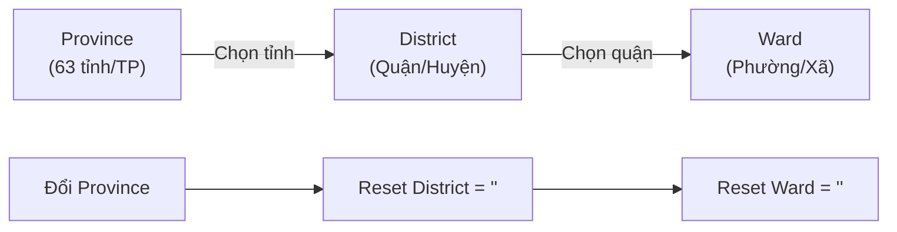
```mermaid
flowchart LR
    P["Province<br/>(63 tỉnh/TP)"] -->|Chọn tỉnh| D["District<br/>(Quận/Huyện)"]
    D -->|Chọn quận| W["Ward<br/>(Phường/Xã)"]

    P2["Đổi Province"] --> D2["Reset District = ''"]
    D2 --> W2["Reset Ward = ''"]
```

> **Dữ liệu tỉnh/huyện/xã** được load từ file JSON tĩnh: `shared/data/vn_provinces_tree.json`, không gọi API.

---

### 5.5. Flow 4 — Áp dụng mã giảm giá (Voucher)

**Trigger:** User nhập mã voucher → Click "Áp dụng".

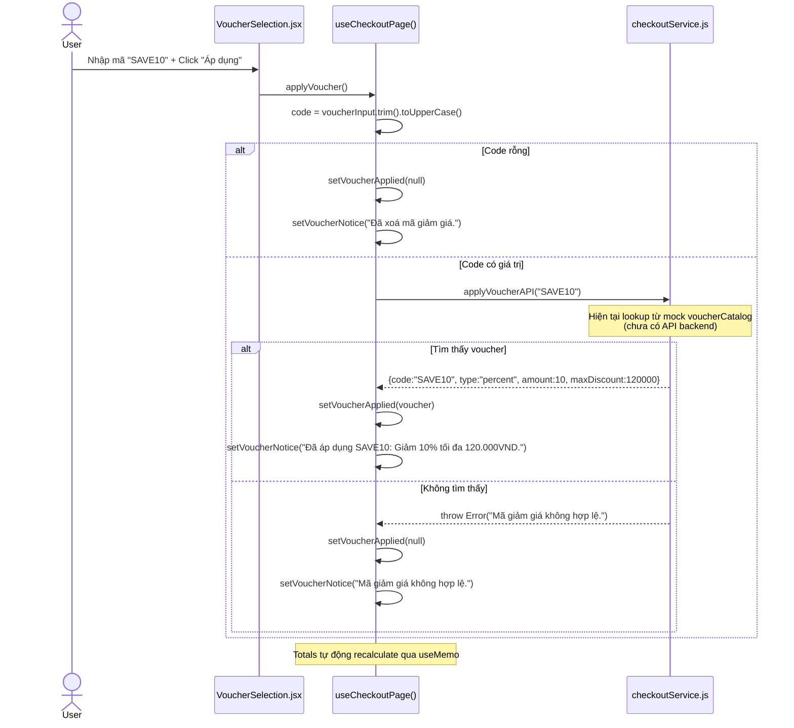
```mermaid
sequenceDiagram
    actor User
    participant VS as VoucherSelection.jsx
    participant UCP as useCheckoutPage()
    participant CS as checkoutService.js

    User->>VS: Nhập mã "SAVE10" + Click "Áp dụng"
    VS->>UCP: applyVoucher()

    UCP->>UCP: code = voucherInput.trim().toUpperCase()
    
    alt Code rỗng
        UCP->>UCP: setVoucherApplied(null)
        UCP->>UCP: setVoucherNotice("Đã xoá mã giảm giá.")
    else Code có giá trị
        UCP->>CS: applyVoucherAPI("SAVE10")
        
        Note over CS: Hiện tại lookup từ mock voucherCatalog<br/>(chưa có API backend)
        
        alt Tìm thấy voucher
            CS-->>UCP: {code:"SAVE10", type:"percent", amount:10, maxDiscount:120000}
            UCP->>UCP: setVoucherApplied(voucher)
            UCP->>UCP: setVoucherNotice("Đã áp dụng SAVE10: Giảm 10% tối đa 120.000VND.")
        else Không tìm thấy
            CS-->>UCP: throw Error("Mã giảm giá không hợp lệ.")
            UCP->>UCP: setVoucherApplied(null)
            UCP->>UCP: setVoucherNotice("Mã giảm giá không hợp lệ.")
        end
    end

    Note over UCP: Totals tự động recalculate qua useMemo
```

**Logic tính giảm giá (checkoutMath.js):**

```javascript
// 3 loại voucher:
// type: "fixed"    → Giảm trực tiếp, max = itemsSubtotal
// type: "percent"  → Giảm %, có maxDiscount cap
// type: "shipping" → Giảm phí ship, max = shippingFee

getDiscountAmount({voucher: {type:"percent", amount:10, maxDiscount:120000}, 
                   itemsSubtotal: 500000, shippingFee: 25000})
// → Math.min(50000, 120000) = 50000
```

---

### 5.6. Flow 5 — Đặt hàng COD (Place Order — Cash on Delivery)

**Trigger:** User nhấn "Đặt Hàng" với phương thức thanh toán COD.

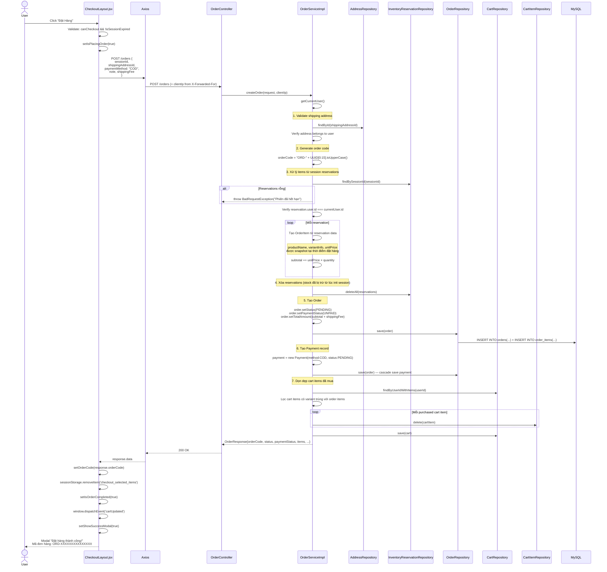
```mermaid
sequenceDiagram
    actor User
    participant CL as CheckoutLayout.jsx
    participant AX as Axios
    participant OC as OrderController
    participant OSI as OrderServiceImpl
    participant AR as AddressRepository
    participant IRR as InventoryReservationRepository
    participant OR as OrderRepository
    participant CR as CartRepository
    participant CIR as CartItemRepository
    participant DB as MySQL

    User->>CL: Click "Đặt Hàng"
    CL->>CL: Validate: canCheckout && !isSessionExpired

    CL->>CL: setIsPlacingOrder(true)
    CL->>AX: POST /orders {<br/>  sessionId,<br/>  shippingAddressId,<br/>  paymentMethod: "COD",<br/>  note, shippingFee<br/>}
    AX->>OC: POST /orders (+ clientIp from X-Forwarded-For)
    OC->>OSI: createOrder(request, clientIp)

    OSI->>OSI: getCurrentUser()
    
    Note over OSI: 1. Validate shipping address
    OSI->>AR: findById(shippingAddressId)
    OSI->>OSI: Verify address belongs to user

    Note over OSI: 2. Generate order code
    OSI->>OSI: orderCode = "ORD-" + UUID[0:15].toUpperCase()

    Note over OSI: 3. Xử lý items từ session reservations
    OSI->>IRR: findBySessionId(sessionId)
    
    alt Reservations rỗng
        OSI-->>OC: throw BadRequestException("Phiên đã hết hạn")
    end

    OSI->>OSI: Verify reservation.user.id === currentUser.id

    loop Mỗi reservation
        OSI->>OSI: Tạo OrderItem từ reservation data
        Note over OSI: productName, variantInfo, unitPrice<br/>được snapshot tại thời điểm đặt hàng
        OSI->>OSI: subtotal += unitPrice × quantity
    end

    Note over OSI: 4. Xóa reservations (stock đã bị trừ từ lúc init session)
    OSI->>IRR: deleteAll(reservations)

    Note over OSI: 5. Tạo Order
    OSI->>OSI: order.setStatus(PENDING)<br/>order.setPaymentStatus(UNPAID)<br/>order.setTotalAmount(subtotal + shippingFee)
    OSI->>OR: save(order)
    OR->>DB: INSERT INTO orders(...) + INSERT INTO order_items(...)

    Note over OSI: 6. Tạo Payment record
    OSI->>OSI: payment = new Payment(method:COD, status:PENDING)
    OSI->>OR: save(order) — cascade save payment

    Note over OSI: 7. Dọn dẹp cart items đã mua
    OSI->>CR: findByUserIdWithItems(userId)
    OSI->>OSI: Lọc cart items có variant trùng với order items
    loop Mỗi purchased cart item
        OSI->>CIR: delete(cartItem)
    end
    OSI->>CR: save(cart)

    OSI-->>OC: OrderResponse{orderCode, status, paymentStatus, items, ...}
    OC-->>AX: 200 OK
    AX-->>CL: response.data

    CL->>CL: setOrderCode(response.orderCode)
    CL->>CL: sessionStorage.removeItem('checkout_selected_items')
    CL->>CL: setIsOrderCompleted(true)
    CL->>CL: window.dispatchEvent('cartUpdated')
    CL->>CL: setShowSuccessModal(true)
    CL-->>User: Modal "Đặt hàng thành công!"<br/>Mã đơn hàng: ORD-XXXXXXXXXXXXXXX
```

**Request/Response:**

```json
// POST /api/v1/orders
// Request Body:
{
  "sessionId": "a1b2c3d4-e5f6-7890-abcd-ef1234567890",
  "shippingAddressId": 301,
  "paymentMethod": "COD",
  "note": "Giao giờ hành chính",
  "shippingFee": 25000
}

// Response 200:
{
  "orderCode": "ORD-A1B2C3D4E5F6789",
  "status": "PENDING",
  "paymentStatus": "UNPAID",
  "channel": "ONLINE",
  "subtotal": 547000,
  "shippingFee": 25000,
  "totalAmount": 572000,
  "note": "Giao giờ hành chính",
  "items": [
    {
      "productName": "Áo thun cotton basic",
      "variantInfo": "M / Trắng",
      "unitPrice": 199000,
      "quantity": 2,
      "subtotal": 398000
    }
  ],
  "paymentUrl": null
}
```

---

### 5.7. Flow 6 — Đặt hàng VNPAY (Payment Gateway Redirect)

**Trigger:** User nhấn "Đặt Hàng" với phương thức thanh toán VNPAY.

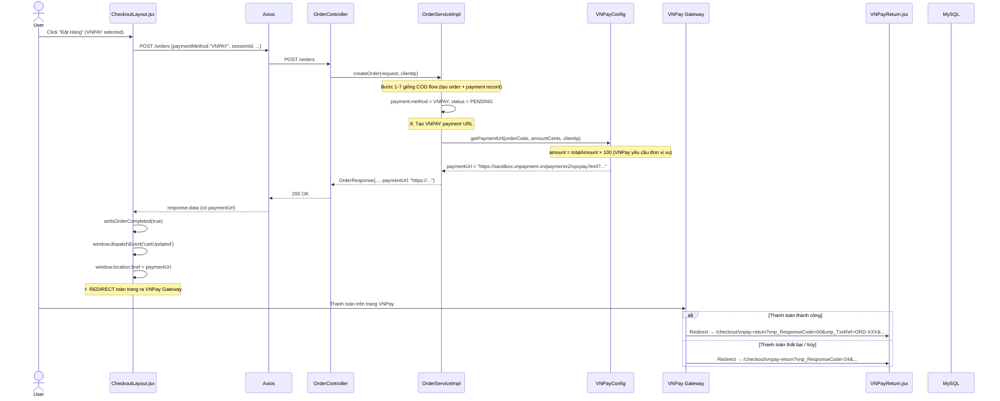
```mermaid
sequenceDiagram
    actor User
    participant CL as CheckoutLayout.jsx
    participant AX as Axios
    participant OC as OrderController
    participant OSI as OrderServiceImpl
    participant VNPAY_CFG as VNPayConfig
    participant VNPAY as VNPay Gateway
    participant VNR as VNPayReturn.jsx
    participant DB as MySQL

    User->>CL: Click "Đặt Hàng" (VNPAY selected)
    CL->>AX: POST /orders {paymentMethod:"VNPAY", sessionId, ...}
    AX->>OC: POST /orders

    OC->>OSI: createOrder(request, clientIp)
    Note over OSI: Bước 1-7 giống COD flow (tạo order + payment record)
    
    OSI->>OSI: payment.method = VNPAY, status = PENDING
    
    Note over OSI: 8. Tạo VNPAY payment URL
    OSI->>VNPAY_CFG: getPaymentUrl(orderCode, amountCents, clientIp)
    Note over VNPAY_CFG: amount = totalAmount × 100 (VNPay yêu cầu đơn vị xu)
    VNPAY_CFG-->>OSI: paymentUrl = "https://sandbox.vnpayment.vn/paymentv2/vpcpay.html?..."

    OSI-->>OC: OrderResponse{..., paymentUrl: "https://..."}
    OC-->>AX: 200 OK
    AX-->>CL: response.data (có paymentUrl)

    CL->>CL: setIsOrderCompleted(true)
    CL->>CL: window.dispatchEvent('cartUpdated')
    CL->>CL: window.location.href = paymentUrl
    Note over CL: ⚡ REDIRECT toàn trang ra VNPay Gateway

    User->>VNPAY: Thanh toán trên trang VNPay
    
    alt Thanh toán thành công
        VNPAY->>VNR: Redirect → /checkout/vnpay-return?vnp_ResponseCode=00&vnp_TxnRef=ORD-XXX&...
    else Thanh toán thất bại / hủy
        VNPAY->>VNR: Redirect → /checkout/vnpay-return?vnp_ResponseCode=24&...
    end
```

---

### 5.8. Flow 7 — Xử lý VNPay Return (Callback)

**Trigger:** User được VNPay redirect về `/checkout/vnpay-return?vnp_...`

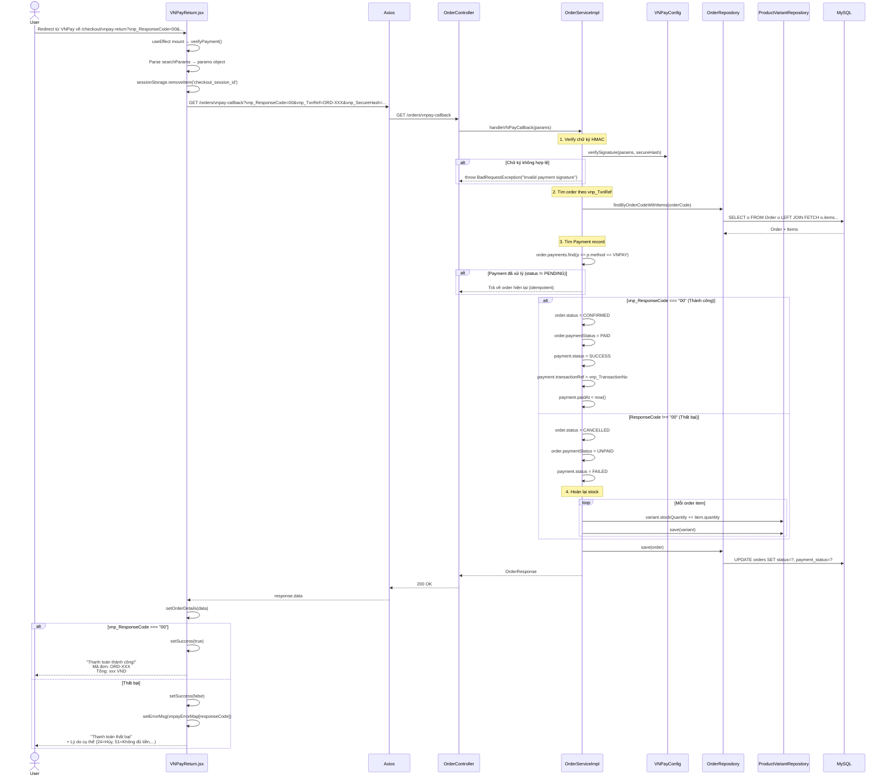
```mermaid
sequenceDiagram
    actor User
    participant VNR as VNPayReturn.jsx
    participant AX as Axios
    participant OC as OrderController
    participant OSI as OrderServiceImpl
    participant VNPAY_CFG as VNPayConfig
    participant OR as OrderRepository
    participant PVR as ProductVariantRepository
    participant DB as MySQL

    User->>VNR: Redirect từ VNPay về /checkout/vnpay-return?vnp_ResponseCode=00&...
    VNR->>VNR: useEffect mount → verifyPayment()
    VNR->>VNR: Parse searchParams → params object
    VNR->>VNR: sessionStorage.removeItem('checkout_session_id')

    VNR->>AX: GET /orders/vnpay-callback?vnp_ResponseCode=00&vnp_TxnRef=ORD-XXX&vnp_SecureHash=...
    AX->>OC: GET /orders/vnpay-callback
    OC->>OSI: handleVNPayCallback(params)

    Note over OSI: 1. Verify chữ ký HMAC
    OSI->>VNPAY_CFG: verifySignature(params, secureHash)
    alt Chữ ký không hợp lệ
        OSI-->>OC: throw BadRequestException("Invalid payment signature")
    end

    Note over OSI: 2. Tìm order theo vnp_TxnRef
    OSI->>OR: findByOrderCodeWithItems(orderCode)
    OR->>DB: SELECT o FROM Order o LEFT JOIN FETCH o.items...
    DB-->>OR: Order + Items

    Note over OSI: 3. Tìm Payment record
    OSI->>OSI: order.payments.find(p => p.method == VNPAY)
    
    alt Payment đã xử lý (status != PENDING)
        OSI-->>OC: Trả về order hiện tại (idempotent)
    end

    alt vnp_ResponseCode === "00" (Thành công)
        OSI->>OSI: order.status = CONFIRMED
        OSI->>OSI: order.paymentStatus = PAID
        OSI->>OSI: payment.status = SUCCESS
        OSI->>OSI: payment.transactionRef = vnp_TransactionNo
        OSI->>OSI: payment.paidAt = now()
    else ResponseCode !== "00" (Thất bại)
        OSI->>OSI: order.status = CANCELLED
        OSI->>OSI: order.paymentStatus = UNPAID
        OSI->>OSI: payment.status = FAILED
        
        Note over OSI: 4. Hoàn lại stock
        loop Mỗi order item
            OSI->>PVR: variant.stockQuantity += item.quantity
            OSI->>PVR: save(variant)
        end
    end

    OSI->>OR: save(order)
    OR->>DB: UPDATE orders SET status=?, payment_status=?
    
    OSI-->>OC: OrderResponse
    OC-->>AX: 200 OK
    AX-->>VNR: response.data

    VNR->>VNR: setOrderDetails(data)
    
    alt vnp_ResponseCode === "00"
        VNR->>VNR: setSuccess(true)
        VNR-->>User: "Thanh toán thành công!"<br/>Mã đơn: ORD-XXX<br/>Tổng: xxx VND
    else Thất bại
        VNR->>VNR: setSuccess(false)
        VNR->>VNR: setErrorMsg(vnpayErrorMap[responseCode])
        VNR-->>User: "Thanh toán thất bại"<br/>+ Lý do cụ thể (24=Hủy, 51=Không đủ tiền,...)
    end
```

**VNPay Error Code Map (Frontend):**

| Code | Message |
|------|---------|
| `07` | Trừ tiền thành công. Giao dịch bị nghi ngờ |
| `09` | Thẻ chưa đăng ký InternetBanking |
| `10` | Xác thực thông tin thẻ sai quá 3 lần |
| `11` | Hết hạn chờ thanh toán |
| `12` | Thẻ/Tài khoản bị khóa |
| `13` | Sai mật khẩu OTP |
| `24` | Hủy giao dịch |
| `51` | Không đủ số dư |
| `65` | Vượt hạn mức giao dịch |
| `75` | Ngân hàng đang bảo trì |
| `79` | Sai mật khẩu quá số lần quy định |
| `99` | Lỗi không xác định |

---

### 5.9. Flow 8 — Session Expiry & Leave Protection (useBlocker)

**Trigger:** Timer countdown hết 15 phút HOẶC user cố rời trang checkout.

```mermaid
sequenceDiagram
    participant CL as CheckoutLayout.jsx
    participant TIMER as setInterval (1s)
    participant BLOCKER as useBlocker()
    participant AX as Axios
    participant CSS as CheckoutSessionService
    participant NAV as React Router

    Note over CL: === COUNTDOWN TIMER ===
    
    CL->>TIMER: Khởi tạo interval khi sessionExpiresAt có giá trị
    
    loop Mỗi 1 giây
        TIMER->>TIMER: distance = expiresTime - now
        alt distance > 0
            TIMER->>CL: setTimeLeft(distance)
            CL-->>User: "🕒 Giữ chỗ trong: MM:SS"
        else distance <= 0
            TIMER->>CL: setTimeLeft(0) + setIsSessionExpired(true)
            CL-->>User: Modal "Hết thời gian giữ chỗ!"<br/>Nút "Quay lại Giỏ hàng"
            Note over CL: clearInterval — dừng timer
        end
    end

    Note over CL: === LEAVE PROTECTION (useBlocker) ===

    User->>NAV: Cố navigate đi trang khác (click link, back button)
    NAV->>BLOCKER: Kiểm tra blocker condition
    
    BLOCKER->>BLOCKER: Kiểm tra điều kiện block:<br/>!isOrderCompleted<br/>&& path thay đổi<br/>&& !isSessionExpired<br/>&& sessionId tồn tại
    
    alt Nên block
        BLOCKER->>CL: blocker.state = 'blocked'
        CL-->>User: Modal "Hủy thanh toán?"<br/>"Sản phẩm sẽ không còn được giữ chỗ"

        alt User chọn "Ở lại"
            User->>CL: blocker.reset()
            Note over CL: Đóng modal, giữ nguyên trang checkout
        else User chọn "Rời đi"
            User->>CL: Hủy session + proceed
            CL->>AX: DELETE /checkout/session/{sessionId}
            AX->>CSS: cancelSession(sessionId)
            Note over CSS: Hoàn lại stock cho tất cả reservations
            CSS->>CSS: variant.stockQuantity += res.quantity
            CSS->>CSS: deleteAll(reservations)
            CL->>BLOCKER: blocker.proceed()
            Note over NAV: Navigate đến trang đích
        end
    end
```

---

## 6. Module 3: ORDER HISTORY (Lịch sử đơn hàng)

### 6.1. Component Architecture

```mermaid
graph TD
    R1["Router /my-orders"] --> MO["MyOrders.jsx<br/>(Customer View)"]
    MO --> ODM["OrderDetailModal.jsx"]
    
    R2["Router /admin/orders"] --> OM["OrderManagement.jsx<br/>(Admin/Staff View)"]
    OM --> ODM

    MO -- "axios.get" --> API1["GET /orders/me"]
    OM -- "orderService.js" --> API2["GET /admin/orders"]
    OM -- "orderService.js" --> API3["PUT /admin/orders/:id/status"]

    style MO fill:#1a1a2e,color:#fff
    style OM fill:#16213e,color:#fff
```

### 6.2. Flow 1 — Xem danh sách đơn hàng của tôi

**Trigger:** User mở trang `/my-orders`.

```mermaid
sequenceDiagram
    actor User
    participant MO as MyOrders.jsx
    participant AX as Axios
    participant OC as OrderController
    participant OSI as OrderServiceImpl
    participant OR as OrderRepository
    participant DB as MySQL

    User->>MO: Mở trang /my-orders
    MO->>MO: useEffect mount → fetchMyOrders()
    MO->>MO: setLoading(true)

    MO->>AX: GET /orders/me
    AX->>OC: GET /orders/me
    OC->>OSI: listMyOrders()
    OSI->>OSI: getCurrentUser()
    OSI->>OR: findByUserIdOrderByCreatedAtDesc(userId)
    OR->>DB: SELECT * FROM orders WHERE user_id = ? ORDER BY created_at DESC
    DB-->>OR: List<Order>

    OSI->>OSI: orders.map(toOrderResponse)
    Note over OSI: Mỗi order → map items, tính subtotal, totalAmount

    OSI-->>OC: List<OrderResponse>
    OC-->>AX: 200 OK
    AX-->>MO: response.data

    MO->>MO: setOrders(data), setLoading(false)
    MO-->>User: Render danh sách đơn hàng (cards)
```

### 6.3. Flow 2 — Lọc đơn hàng theo trạng thái (Client-side Filter)

```mermaid
flowchart TD
    A["User click tab trạng thái"] --> B["setActiveTab(key)"]
    B --> C["useMemo: filteredOrders"]
    C --> D{activeTab === 'ALL'?}
    D -->|Có| E["Trả về toàn bộ orders"]
    D -->|Không| F["orders.filter(o => o.status === activeTab)"]
    E --> G["Re-render danh sách"]
    F --> G

    H["Tabs available"] --> I["ALL · PENDING · CONFIRMED · SHIPPING · COMPLETED · CANCELLED"]
    
    style A fill:#1a1a2e,color:#fff
```

> **Lưu ý:** Filtering xảy ra hoàn toàn ở client-side (không gọi lại API). Dữ liệu được fetch một lần khi mount.

### 6.4. Flow 3 — Xem chi tiết đơn hàng (OrderDetailModal)

**Trigger:** User click "Xem chi tiết" trên order card.

```mermaid
sequenceDiagram
    actor User
    participant MO as MyOrders.jsx
    participant ODM as OrderDetailModal.jsx

    User->>MO: Click "Xem chi tiết" trên order card
    MO->>MO: setSelectedOrder(order)
    MO->>MO: setShowModal(true)
    MO->>ODM: show=true, order={...}
    ODM-->>User: Modal hiển thị:<br/>• Header: Order Code + Status Badge + Payment Badge<br/>• Table: Danh sách sản phẩm (tên, phân loại, đơn giá, SL, thành tiền)<br/>• Pricing: Tạm tính + Phí ship + Tổng cộng<br/>• Note: Ghi chú từ khách hàng

    User->>ODM: Click "Đóng"
    ODM->>MO: onHide()
    MO->>MO: setShowModal(false)
```

### 6.5. Flow 4 — Admin: Quản lý đơn hàng (Search + Filter)

**Trigger:** Admin/Staff mở trang `/admin/orders`.

```mermaid
sequenceDiagram
    actor Admin
    participant OM as OrderManagement.jsx
    participant OS as orderService.js
    participant AX as Axios
    participant AOC as AdminOrderController
    participant AOSI as AdminOrderServiceImpl
    participant AOR as AdminOrderRepository
    participant DB as MySQL

    Admin->>OM: Mở trang /admin/orders
    OM->>OS: getOrders({status: undefined, channel: undefined, keyword: undefined})
    OS->>AX: GET /admin/orders
    AX->>AOC: GET /admin/orders
    AOC->>AOSI: search(null, null, null)
    AOSI->>AOR: Xây dựng Specification query
    AOR->>DB: SELECT * FROM orders (JOIN items, user, address...)<br/>WHERE (no filters)
    DB-->>AOR: List<Order>
    AOSI-->>AOC: List<AdminOrderResponse>
    AOC-->>AX: 200 OK
    AX-->>OM: orders data

    Admin->>OM: Chọn filter: status=PENDING, channel=ONLINE
    OM->>OS: getOrders({status:"PENDING", channel:"ONLINE"})
    OS->>AX: GET /admin/orders?status=PENDING&channel=ONLINE
    AX->>AOC: GET /admin/orders
    AOC->>AOSI: search(PENDING, ONLINE, null)
    AOSI->>AOR: WHERE status='PENDING' AND channel='ONLINE'
    DB-->>OM: Filtered orders
```

### 6.6. Flow 5 — Admin: Cập nhật trạng thái đơn hàng

**Trigger:** Admin click đổi trạng thái đơn hàng.

```mermaid
sequenceDiagram
    actor Admin
    participant OM as OrderManagement.jsx
    participant OS as orderService.js
    participant AX as Axios
    participant AOC as AdminOrderController
    participant AOSI as AdminOrderServiceImpl
    participant OR as OrderRepository
    participant DB as MySQL

    Admin->>OM: Chọn trạng thái mới cho đơn #123
    OM->>OS: updateOrderStatus(123, "CONFIRMED")
    OS->>AX: PUT /admin/orders/123/status {status: "CONFIRMED"}
    AX->>AOC: PUT /admin/orders/{id}/status
    AOC->>AOSI: updateStatus(id, UpdateOrderStatusRequest)

    AOSI->>OR: findById(id)
    OR->>DB: SELECT * FROM orders WHERE id = 123
    DB-->>OR: Order

    AOSI->>AOSI: Validate status transition logic
    AOSI->>AOSI: order.setStatus(CONFIRMED)
    AOSI->>OR: save(order)
    OR->>DB: UPDATE orders SET status = 'CONFIRMED' WHERE id = 123

    AOSI-->>AOC: AdminOrderResponse (updated)
    AOC-->>AX: 200 OK
    AX-->>OM: Updated order data
    OM->>OM: Cập nhật UI
```

**Order Status Lifecycle:**

```mermaid
stateDiagram-v2
    [*] --> PENDING: Đơn mới tạo

    PENDING --> CONFIRMED: Admin xác nhận<br/>hoặc VNPay thành công
    PENDING --> CANCELLED: Admin hủy<br/>hoặc VNPay thất bại<br/>hoặc expired (15 min)

    CONFIRMED --> PROCESSING: Admin chuyển xử lý
    PROCESSING --> SHIPPING: Admin chuyển giao
    SHIPPING --> DELIVERED: Giao thành công
    DELIVERED --> COMPLETED: Hoàn tất

    CONFIRMED --> CANCELLED: Admin hủy
    PROCESSING --> CANCELLED: Admin hủy

    CANCELLED --> [*]
    COMPLETED --> [*]
```

**Payment Status Lifecycle:**

```mermaid
stateDiagram-v2
    [*] --> UNPAID: Đơn mới tạo (COD)
    [*] --> PENDING_TXN: Đơn VNPAY tạo

    PENDING_TXN --> PAID: VNPay callback success
    PENDING_TXN --> FAILED: VNPay callback fail<br/>hoặc expired
    
    UNPAID --> PAID: Nhận tiền COD

    PAID --> REFUNDED: Hoàn tiền

    state PENDING_TXN {
        note: PaymentTxnStatus.PENDING
    }
```

---

## 7. Module 4: ADDRESS (Sổ địa chỉ)

### 7.1. Component Architecture

```mermaid
graph TD
    R["Router /account/addresses"] --> MA["MyAddresses.jsx<br/>(Main Page)"]
    MA --> AFM["AddressFormModal.jsx<br/>(Shared Component from checkout)"]
    MA --> DEL_MODAL["Delete Confirm Modal<br/>(Built-in)"]
    MA --> NOTICE_MODAL["Alert/Notice Modal<br/>(Built-in)"]

    MA -- "imports" --> CS["checkoutService.js<br/>(getAddressesAPI, addAddressAPI, deleteAddressAPI)"]
    CS -- "axios" --> API["Backend /addresses/*"]

    style MA fill:#1a1a2e,color:#fff
```

> **Lưu ý:** Trang `MyAddresses.jsx` tái sử dụng `AddressFormModal.jsx` và API service từ module checkout (`checkoutService.js`).

### 7.2. Flow 1 — Xem danh sách địa chỉ

**Trigger:** User mở trang `/account/addresses`.

```mermaid
sequenceDiagram
    actor User
    participant MA as MyAddresses.jsx
    participant CS as checkoutService.js
    participant AX as Axios
    participant AC as AddressController
    participant ASI as AddressServiceImpl
    participant AR as AddressRepository
    participant DB as MySQL

    User->>MA: Mở trang /account/addresses
    MA->>MA: useEffect mount → fetchAddresses()
    MA->>MA: setLoading(true)

    MA->>CS: getAddressesAPI()
    CS->>AX: GET /addresses
    AX->>AC: GET /addresses
    AC->>ASI: getMyAddresses()
    ASI->>ASI: getCurrentUser()
    ASI->>AR: findByUserIdOrderByIsDefaultDescCreatedAtDesc(userId)
    AR->>DB: SELECT * FROM addresses<br/>WHERE user_id = ?<br/>ORDER BY is_default DESC, created_at DESC
    DB-->>AR: List<Address> (default đứng đầu)

    ASI->>ASI: addresses.map(toDto)
    ASI-->>AC: List<AddressDto>
    AC-->>AX: 200 OK
    AX-->>MA: response.data

    MA->>MA: setAddresses(data), setLoading(false)
    MA-->>User: Render grid card (md=6 mỗi card)<br/>Badge "Mặc định" cho default address
```

**Response:**

```json
// GET /api/v1/addresses
// Response 200:
[
  {
    "id": 301,
    "recipientName": "Nguyễn Văn A",
    "phone": "0987654321",
    "province": "Thành phố Hồ Chí Minh",
    "district": "Quận 3",
    "ward": "Phường Võ Thị Sáu",
    "street": "12 Nguyễn Thượng Hiền",
    "isDefault": true
  },
  {
    "id": 302,
    "recipientName": "Nguyễn Văn A",
    "phone": "0987654321",
    "province": "Thành phố Hồ Chí Minh",
    "district": "Quận 1",
    "ward": "Phường Đa Kao",
    "street": "83 Đinh Tiên Hoàng",
    "isDefault": false
  }
]
```

---

### 7.3. Flow 2 — Thêm địa chỉ mới

**Trigger:** User click "Thêm địa chỉ mới" → Điền form → Lưu.

```mermaid
sequenceDiagram
    actor User
    participant MA as MyAddresses.jsx
    participant AFM as AddressFormModal.jsx
    participant CS as checkoutService.js
    participant AX as Axios
    participant AC as AddressController
    participant ASI as AddressServiceImpl
    participant AR as AddressRepository
    participant DB as MySQL

    User->>MA: Click "Thêm địa chỉ mới"
    MA->>AFM: setShowAddModal(true)
    AFM-->>User: Form thêm địa chỉ

    User->>AFM: Điền đầy đủ + Click "Lưu"
    AFM->>AFM: Validate HTML5 + phone regex
    AFM->>MA: onSave(formData)

    MA->>CS: addAddressAPI(formData)
    CS->>AX: POST /addresses {...formData}
    AX->>AC: POST /addresses
    AC->>ASI: addAddress(AddressDto)

    ASI->>ASI: getCurrentUser()
    ASI->>AR: findByUserId(userId)
    
    alt Đây là địa chỉ đầu tiên HOẶC isDefault=true
        ASI->>ASI: shouldBeDefault = true
        
        alt Có address cũ đang default
            loop Mỗi existing default address
                ASI->>AR: existing.setIsDefault(false), save()
                AR->>DB: UPDATE addresses SET is_default=false WHERE id=?
            end
        end
    end

    ASI->>AR: save(newAddress)
    AR->>DB: INSERT INTO addresses(...)
    ASI-->>AC: AddressDto

    AC-->>AX: 200 OK
    AX-->>MA: response.data

    MA->>MA: setShowAddModal(false)
    MA->>MA: fetchAddresses() — reload danh sách
```

---

### 7.4. Flow 3 — Xóa địa chỉ

**Trigger:** User click icon 🗑️ → Confirm Modal → Xác nhận xóa.

```mermaid
sequenceDiagram
    actor User
    participant MA as MyAddresses.jsx
    participant MODAL as Delete Confirm Modal
    participant CS as checkoutService.js
    participant AX as Axios
    participant AC as AddressController
    participant ASI as AddressServiceImpl
    participant OR as OrderRepository
    participant AR as AddressRepository
    participant DB as MySQL

    User->>MA: Click 🗑️ trên address card
    MA->>MODAL: setDeleteTarget(addr)
    MODAL-->>User: "Bạn có chắc chắn muốn xóa?"<br/>Hiển thị thông tin địa chỉ

    User->>MODAL: Click "Xác nhận xóa"
    MODAL->>MA: handleConfirmDelete()
    MA->>MA: setDeleting(true)

    MA->>CS: deleteAddressAPI(addr.id)
    CS->>AX: DELETE /addresses/301
    AX->>AC: DELETE /addresses/{id}
    AC->>ASI: deleteAddress(id)

    ASI->>ASI: getCurrentUser()
    ASI->>AR: findById(id)
    ASI->>ASI: Validate ownership (address.user.id === currentUser.id)

    Note over ASI: ⚡ Quan trọng: Unlink address khỏi orders cũ
    ASI->>OR: unlinkShippingAddress(id)
    OR->>DB: UPDATE orders SET shipping_address_id = NULL<br/>WHERE shipping_address_id = ?
    Note over OR: Tránh Foreign Key constraint error

    ASI->>ASI: wasDefault = address.isDefault
    ASI->>AR: delete(address)
    AR->>DB: DELETE FROM addresses WHERE id = ?

    alt Nếu address vừa xóa là default
        ASI->>AR: findByUserId(userId)
        alt Còn address khác
            ASI->>ASI: remaining[0].setIsDefault(true)
            ASI->>AR: save(newDefault)
            AR->>DB: UPDATE addresses SET is_default=true WHERE id=?
            Note over ASI: Auto-promote address đầu tiên thành default
        end
    end

    ASI-->>AC: void
    AC-->>AX: 204 No Content
    AX-->>MA: Success

    MA->>MA: setDeleteTarget(null)
    MA->>MA: fetchAddresses() — reload danh sách
```

### 7.5. Auto-assign Default Address Logic

```mermaid
flowchart TD
    A["Thao tác trên Address"] --> B{Loại thao tác?}
    
    B -->|Thêm mới| C{Đây là address đầu tiên?}
    C -->|Có| D["Set isDefault = true tự động"]
    C -->|Không| E{isDefault = true?}
    E -->|Có| F["Bỏ default cũ → Set default mới"]
    E -->|Không| G["Giữ nguyên, thêm bình thường"]

    B -->|Xóa| H{Address bị xóa là default?}
    H -->|Có| I["Promote remaining[0]<br/>thành default mới"]
    H -->|Không| J["Không thay đổi gì"]

    style A fill:#1a1a2e,color:#fff
```

---

## 8. Background Processes

### 8.1. Cleanup Expired Inventory Reservations

**Service:** `CheckoutSessionService.releaseExpiredReservations()`  
**Schedule:** `@Scheduled(fixedRate = 60000)` — chạy mỗi 60 giây  
**Mục đích:** Giải phóng stock đã bị reserve khi checkout session hết hạn (15 phút).

```mermaid
sequenceDiagram
    participant SCHEDULER as Spring Scheduler<br/>(mỗi 60s)
    participant CSS as CheckoutSessionService
    participant IRR as InventoryReservationRepository
    participant PVR as ProductVariantRepository
    participant DB as MySQL

    SCHEDULER->>CSS: releaseExpiredReservations()
    CSS->>IRR: findByExpiresAtBefore(now())
    IRR->>DB: SELECT * FROM inventory_reservations WHERE expires_at < NOW()
    DB-->>IRR: List<InventoryReservation> (expired ones)

    alt Có reservation hết hạn
        CSS->>CSS: log.info("Releasing {} expired reservations", count)
        loop Mỗi expired reservation
            CSS->>PVR: variant.stockQuantity += res.quantity
            CSS->>PVR: save(variant)
            Note over PVR: ⚡ Hoàn lại stock vào product_variants
            CSS->>IRR: delete(res)
        end
    end
```

### 8.2. Cleanup Expired Pending Orders

**Service:** `OrderServiceImpl.cleanupExpiredPendingOrders()`  
**Schedule:** `@Scheduled(fixedRate = 60000)` — chạy mỗi 60 giây  
**Mục đích:** Hủy đơn hàng PENDING quá 15 phút (VNPay chưa thanh toán) và hoàn stock.

```mermaid
sequenceDiagram
    participant SCHEDULER as Spring Scheduler<br/>(mỗi 60s)
    participant OSI as OrderServiceImpl
    participant OR as OrderRepository
    participant PVR as ProductVariantRepository
    participant DB as MySQL

    SCHEDULER->>OSI: cleanupExpiredPendingOrders()
    OSI->>OSI: threshold = now() - 15 phút
    OSI->>OR: findByStatusAndCreatedAtBeforeWithItems(PENDING, threshold)
    OR->>DB: SELECT o FROM Order o<br/>LEFT JOIN FETCH o.items i<br/>LEFT JOIN FETCH i.variant v<br/>WHERE o.status = 'PENDING'<br/>AND o.created_at <= ?
    DB-->>OR: List<Order> (expired pending)

    alt Có đơn hàng hết hạn
        OSI->>OSI: log.info("Found {} expired PENDING orders", count)
        loop Mỗi expired order
            OSI->>OSI: order.setStatus(CANCELLED)
            
            loop Mỗi payment (status = PENDING)
                OSI->>OSI: payment.setStatus(FAILED)
            end

            Note over OSI: Hoàn lại stock
            loop Mỗi order item
                OSI->>PVR: variant.stockQuantity += item.quantity
                OSI->>PVR: save(variant)
            end

            OSI->>OR: save(order)
            OSI->>OSI: log.info("Cancelled order {}", orderCode)
        end
    end
```

---

## 9. Cross-Module Data Flow

### 9.1. Luồng chính: Từ sản phẩm → Giỏ hàng → Thanh toán → Đơn hàng

```mermaid
flowchart LR
    subgraph BROWSE["🛍️ Duyệt SP"]
        A["User xem sản phẩm"]
    end

    subgraph CART["🛒 Cart Module"]
        B["Thêm vào giỏ<br/>(POST /carts/items)"]
        C["Chọn sản phẩm<br/>(checkbox)"]
        D["Tiến hành thanh toán"]
    end

    subgraph CHECKOUT["💳 Checkout Module"]
        E["Init Checkout Session<br/>(POST /checkout/session/init)"]
        F["Reserve Inventory<br/>(variant.stock -= qty)"]
        G["Chọn địa chỉ + ship + payment"]
        H["Đặt hàng<br/>(POST /orders)"]
    end

    subgraph ORDER["📋 Order Module"]
        I["Order created<br/>(status: PENDING)"]
        J{Payment method?}
        K["COD → Chờ giao hàng"]
        L["VNPAY → Redirect thanh toán"]
        M["VNPAY callback"]
        N["Order CONFIRMED / CANCELLED"]
    end

    subgraph HISTORY["📜 Order History"]
        O["GET /orders/me"]
        P["Xem chi tiết đơn"]
    end

    A --> B
    B --> C
    C --> D
    D --> E
    E --> F
    F --> G
    G --> H
    H --> I
    I --> J
    J -->|COD| K
    J -->|VNPAY| L
    L --> M
    M --> N
    K --> O
    N --> O
    O --> P
```

### 9.2. Data Flow xuyên suốt các bảng Database

```mermaid
flowchart TD
    subgraph CART_PHASE["Phase 1: Cart"]
        PV1["product_variants<br/>(đọc stock)"] --> CI["cart_items<br/>(lưu variant + qty)"]
        U1["users"] --> C["carts"]
        C --> CI
    end

    subgraph RESERVE_PHASE["Phase 2: Checkout Session"]
        CI -->|"init session"| IR["inventory_reservations<br/>(session_id, variant, qty, expires)"]
        PV2["product_variants<br/>(stock -= qty)"] --> IR
    end

    subgraph ORDER_PHASE["Phase 3: Create Order"]
        IR -->|"create order"| O["orders<br/>(order_code, status, totals)"]
        O --> OI["order_items<br/>(snapshot product data)"]
        O --> PAY["payments<br/>(method, status, txn_ref)"]
        ADDR["addresses"] --> O
        IR -->|"delete reservations"| GONE["❌ Reservations deleted"]
        CI2["cart_items<br/>(purchased items)"] -->|"delete"| GONE2["❌ Cart items cleaned"]
    end

    subgraph HISTORY_PHASE["Phase 4: Order History"]
        O -->|"GET /orders/me"| VIEW["Customer views orders"]
        O -->|"GET /admin/orders"| ADMIN["Admin manages orders"]
    end

    style CART_PHASE fill:#1a3a2e,color:#fff
    style RESERVE_PHASE fill:#3a1a2e,color:#fff
    style ORDER_PHASE fill:#1a2e3a,color:#fff
    style HISTORY_PHASE fill:#2e3a1a,color:#fff
```

### 9.3. Inventory Stock Flow — Vòng đời tồn kho

```mermaid
flowchart TD
    STOCK["product_variants.stock_quantity<br/>(Giá trị ban đầu: N)"]
    
    STOCK -->|"Checkout Session init"| RESERVE["stock -= reserved_qty<br/>+ Tạo inventory_reservation"]
    
    RESERVE -->|"Đặt hàng thành công"| ORDER["Xóa reservation<br/>(stock đã bị trừ từ trước)"]
    
    RESERVE -->|"Session hết hạn (15 min)"| EXPIRE["Scheduler: stock += reserved_qty<br/>Xóa reservation"]
    
    RESERVE -->|"User hủy checkout"| CANCEL_SESSION["cancelSession: stock += reserved_qty<br/>Xóa reservation"]
    
    ORDER -->|"VNPay thất bại"| RESTORE["handleVNPayCallback:<br/>stock += order_item.quantity<br/>order.status = CANCELLED"]
    
    ORDER -->|"Đơn PENDING > 15 min"| CLEANUP["Scheduler:<br/>stock += order_item.quantity<br/>order.status = CANCELLED"]

    style STOCK fill:#1a1a2e,color:#fff
    style RESERVE fill:#e74c3c,color:#fff
    style ORDER fill:#2ecc71,color:#fff
    style EXPIRE fill:#f39c12,color:#fff
    style CANCEL_SESSION fill:#f39c12,color:#fff
    style RESTORE fill:#e74c3c,color:#fff
    style CLEANUP fill:#e74c3c,color:#fff
```

> **Nguyên tắc cốt lõi:** Stock luôn được đảm bảo tính toàn vẹn — mỗi lần trừ stock đều có cơ chế hoàn lại tương ứng (session expiry, VNPay failure, order timeout).

---

## Phụ lục: Danh sách file code thuộc phạm vi

### Backend (28 files)

| # | Module | File |
|---|--------|------|
| 1 | Cart | `CartController.java` |
| 2 | Cart | `CartService.java` (interface) |
| 3 | Cart | `CartServiceImpl.java` |
| 4 | Cart | `CartRepository.java` |
| 5 | Cart | `CartItemRepository.java` |
| 6 | Cart | `AddCartItemRequest.java` |
| 7 | Cart | `UpdateCartItemRequest.java` |
| 8 | Cart | `CartResponse.java` |
| 9 | Cart | `CartItemResponse.java` |
| 10 | Cart | `AddressDto.java` |
| 11 | Order | `OrderController.java` |
| 12 | Order | `CheckoutSessionController.java` |
| 13 | Order | `AdminOrderController.java` |
| 14 | Order | `OrderService.java` (interface) |
| 15 | Order | `OrderServiceImpl.java` |
| 16 | Order | `CheckoutSessionService.java` |
| 17 | Order | `AdminOrderService.java` (interface) |
| 18 | Order | `AdminOrderServiceImpl.java` |
| 19 | Order | `OrderRepository.java` |
| 20 | Order | `InventoryReservationRepository.java` |
| 21 | Order | `OrderItemRepository.java` |
| 22 | Order | `PaymentRepository.java` |
| 23 | Order | `CreateOrderRequest.java` + 8 DTOs |
| 24 | Address | `AddressController.java` |
| 25 | Address | `AddressService.java` (interface) |
| 26 | Address | `AddressServiceImpl.java` |
| 27 | Address | `AddressRepository.java` |
| 28 | Entities | `Cart, CartItem, Order, OrderItem, Payment, InventoryReservation, Address` |

### Frontend (22 files)

| # | Module | File |
|---|--------|------|
| 1 | Cart | `CartExperience.jsx` |
| 2 | Cart | `CartItemList.jsx` |
| 3 | Cart | `CartItemCard.jsx` |
| 4 | Cart | `useCartExperience.js` |
| 5 | Cart | `useCartItems.js` |
| 6 | Cart | `cartService.js` |
| 7 | Cart | `cartMath.js` |
| 8 | Cart | `cartMock.js` |
| 9 | Checkout | `CheckoutLayout.jsx` |
| 10 | Checkout | `AddressSelection.jsx` |
| 11 | Checkout | `AddressFormModal.jsx` |
| 12 | Checkout | `CheckoutSummary.jsx` |
| 13 | Checkout | `PaymentMethodSelector.jsx` |
| 14 | Checkout | `ShippingSelection.jsx` |
| 15 | Checkout | `VoucherSelection.jsx` |
| 16 | Checkout | `VNPayReturn.jsx` |
| 17 | Checkout | `useCheckoutPage.js` |
| 18 | Checkout | `checkoutService.js` |
| 19 | Checkout | `checkoutMath.js` |
| 20 | Orders | `MyOrders.jsx` |
| 21 | Orders | `OrderDetailModal.jsx` |
| 22 | Orders | `orderService.js` |
| 23 | Account | `MyAddresses.jsx` |
| 24 | Shared | `axios.js` |
